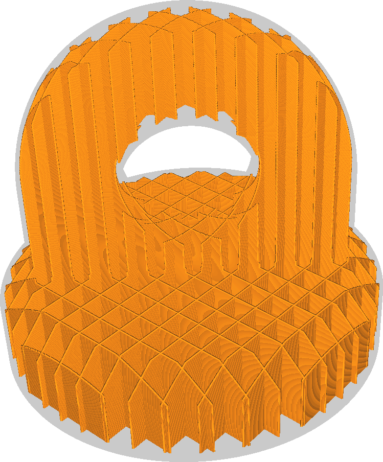

Výplňová podpěra
====
Je-li aktivováno, považuje tento systém výplně za podpěru. Výplň bude generována pouze tam, kde je potřeba podepřít horní povrch. Chová se, jako by byl model dutý a generoval uvnitř podpěru, ale tato podpěra je generována pomocí parametrů výplně.

* To šetří spoustu materiálu výplně při velmi nízkých vizuálních nákladech.
* Když je tato funkce aktivována, mohou se horní povrchy trochu prohýbat.
* Horizontální pevnost výplně však může být zdecimován. V mnoha případech nebude za stěnami žádná výplň, pokud jsou stěny součástí strmého svahu.