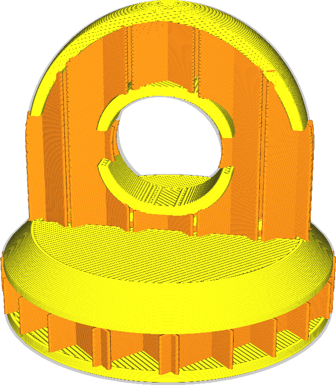
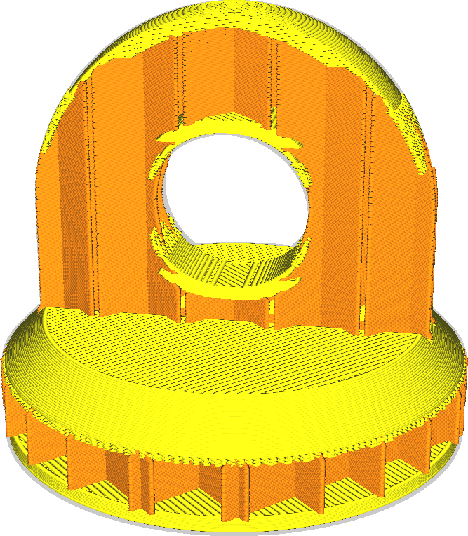

Minimální šířka pláště pro rozšíření
====
Protože se plášť nachází v celém modelu, je zbytečné rozšiřovat všechny tyto oblasti. Naopak budou rozšířeny pouze úhly pláště, které jsou již širší než tento parametr. Tímto způsobem budou ploché vnější vrstvy s vyčnívajícími prvky vyztuženy, aniž by byla zbytečně zvyšována doba tisku pro zbytek modelu.

Rozšíření pláště je užitečné pro posílení vazby mezi horním nebo dolním okrajem tisku a bočními stěnami. Může však také výrazně prodloužit dobu tisku a spotřebu materiálu. Toto nastavení umožňuje filtrovat materiál ze stran tisku, kde je méně užitečný pro posílení vazby mezi stěnami a pláštěm.

Tento parametr můžete také nakonfigurovat pomocí parametru [Maximální úhel pláště pro rozšíření](max_skin_angle_for_expansion.md). Pokud se toto nastavení změní, bude automaticky změněno i toto nastavení. Tento parametr se používá pro slicování.