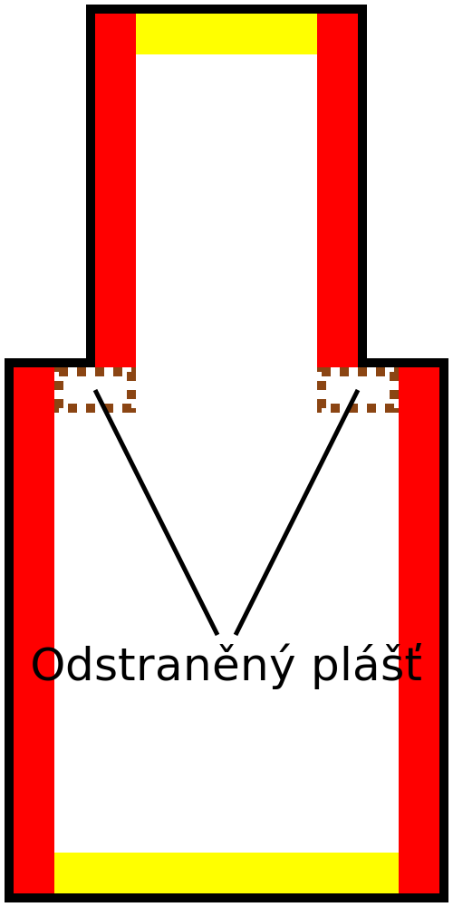

Šířka odstranění pláště
====
Toto nastavení odstraní velmi tenké proužky pláště a nahradí je výplní.

The skin will only be removed if there is infill next to it, so it won't remove the skin at the very top or bottom of your print, even if that is very thin.
Plášť bude odstraněn pouze v případě, že je vedle ní výplň, takže plášť nebude odstraněn na samém horním nebo dolním okraji vašeho tisku, i když je velmi tenký.

Plášť je normálně generována na jakémkoli místě, které je svisle blízko k horní nebo dolní části objektu. Není to všude. Svislé stěny jsou obvykle celkem pevné, takže zatímco vedle svislých stěn by měl být normálně plášť, toto nastavení vám ho umožňuje vynechat. To šetří čas a tiskový materiál.

U většiny výtisků je nastavení této šířky na 1 nebo 2 řádky užitečné ke zkrácení doby tisku. Navíc, pokud je plášť pro tisk příliš tenký, zanechá Cura, tam kde by měl být plášť, mezeru (ale byl příliš malý). Výplň se ke stěnám správně nepřipojí. Pokud je povolena možnost [Vyplnit mezery mezi stěnami](../shell/fill_perimeter_gaps.md), tyto mezery se zaplní, ale tento způsob plnění zabere více času než obyčejný plášť. Nastavení tohoto parametru alespoň na hodnotu [šířky horní/dolní linie](../resolution/skin_line_width.md) zabrání, aby k tomu došlo.
Pokud je nastavení příliš zvýšeno, mohou se na horní a dolní ploše, kde je výplň vystavena, objevit mezery. Zejména se dobře starejte o modely, které mají tenké římsy, které by měly získat tenký pruh pláště.

