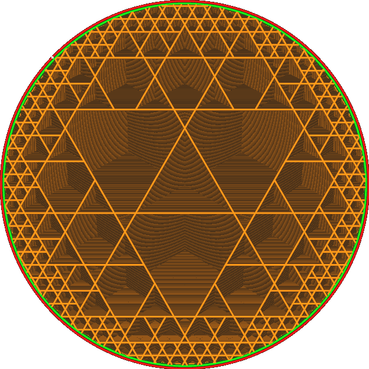

Kubické členění skořepiny
====
Toto nastavení způsobí, že vzor výplně kubického členění začne trochu snižovat vnitřní výplň, čímž se zlepší odolnost tisku.

Kubické členění funguje tak, že odstraní hranice mezi osmi sousedními krychlemi, pokud se žádná z krychlí nedotkne hranice objemu výplně. Toto nastavení posune tuto hranici dále dovnitř a zabrání odstranění hranic mezi krychlemi.

Ve skutečnosti to umožňuje vzoru kubického členění čerpat maximální hustotu častěji. To zvyšuje odolnost objektu, ale také čas a materiál potřebný k jeho tisku. V krajním případě, pokud tento parametr je dostatečně zvýšen, bude schéma kubického členění stejné jako u jednoduchého krychlového schématu.

Tento parametr můžete také nastavit na záporné číslo. To umožňuje, aby hranice mezi krychlemi byly odstraňovány častěji, čímž se snižuje množství výplně na okrajích.