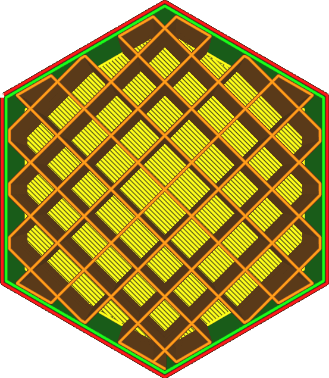

Propojit linie výplně
==
Tato volba umožňuje přidat linie, které spojují koncové body vzoru výplně, kde výplň narazí na vnitřní stěnu nebo na plášť, použitím linií, které sledují hrany oblasti výplně.

Tím se celý vzor výplně převede na jednu nebo na velmi málo linií. Převod na jednu linii není vždy možný. Počáteční bod této linie je libovolný, takže nemusí být stejný pro každou vrstvu, zejména pokud se tvar výplně od jedné vrstvy k druhé liší.

Propojení výplně má některé výhody, ale také některé nevýhody:
* Váš díl bude nakonec pevnější, protože je tu prakticky polovina obrysu navíc.
* Materiál výplně lépe přilne ke stěnám díky zvětšení povrchu, což zvyšuje pevnost součásti.
* Tok bude udržován konstantní, což vám umožní tisknout výplň vyšší rychlostí bez problémů s průtokem. To je zvláště důležité u materiálů, které je obtížné řádně vytlačovat.
* Během tisku dojde k podstatně menšímu počtu retrakcí, což zabraňuje obrušování materiálu.
* Účinek parametru [Procento překrytí výplně](infill_overlap.md) je zesílen, protože se více linií výplně překrývá se stěnami.
* Vytištění výplně bude vyžadovat více materiálu.
* Tisk výplně obvykle trvá déle, protože pohyb přesunu je obvykle rychlejší než tisk výplní.
* Výplň bude obecně více prosvítat stěnami, protože bude tlačena do větší části stěn.