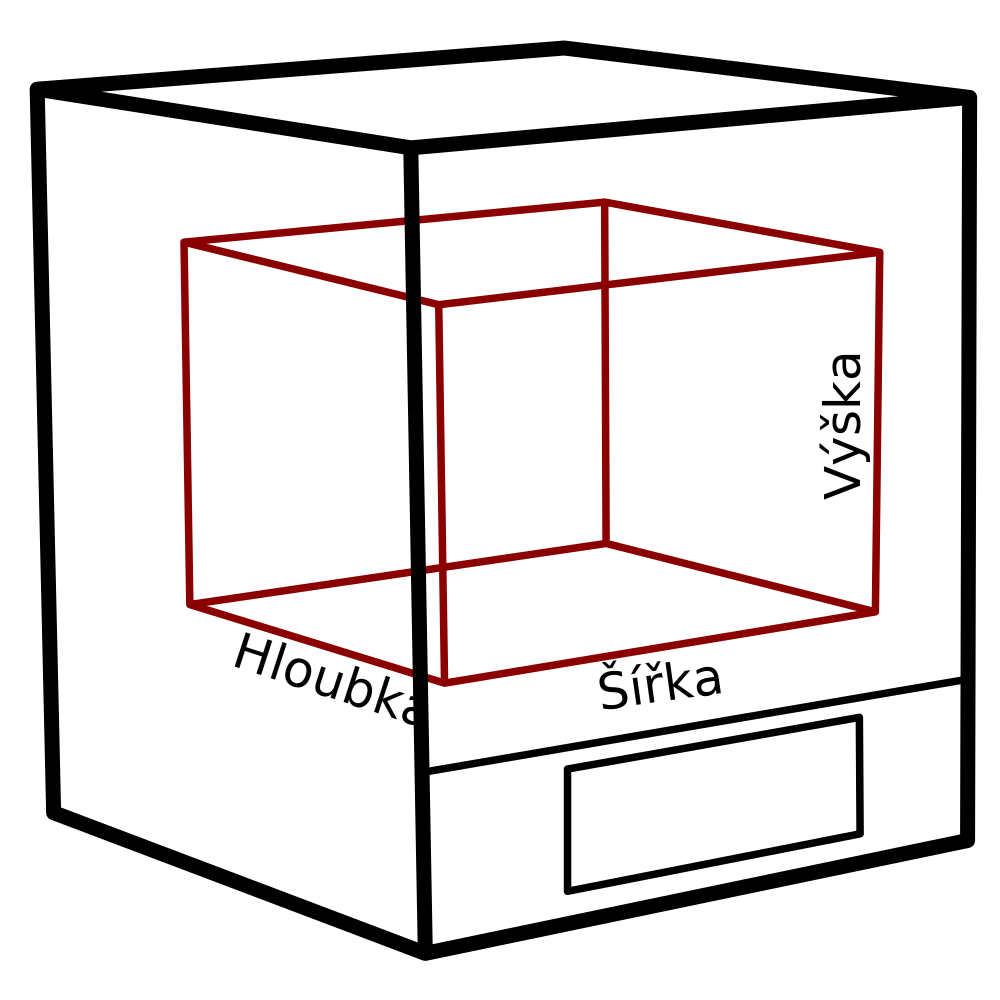

Hloubka zařízení
====
Toto nastavení označuje rozsah souřadnic Y, kterými se tryska může pohybovat. V zásadě jde o použitelný rozměr tiskárny.

To se nerovná skutečné hloubce vaší tiskárny na polici. Skutečná tiskárna bude mít kolem svého objemu tisku také rám nebo rameno a tento rozměr tuto velikost nezahrnuje. Je to pouze souřadnice velikosti objemu tisku, kam se tryska může pohybovat.

Pokud se jedná o více trysek, nemusí všechny trysky dosáhnout celého objemu tisku. U některých tiskáren, pokud má tiskárna různé vzájemné přesazení trysek, nebudou některé trysky schopny dosáhnout až k jedné straně objemu tisku. Toto nastavení indikuje pouze sjednocení objemů, kterých jsou schopny dosáhnout všechny trysky.

**Protože se jedná o nastavení stroje, nebude obvykle uvedeno v normálním seznamu nastavení. Hloubku lze změnit v dialogu nastavení tiskárny, který najdete v seznamu přidaných tiskáren v dialogu předvoleb.**