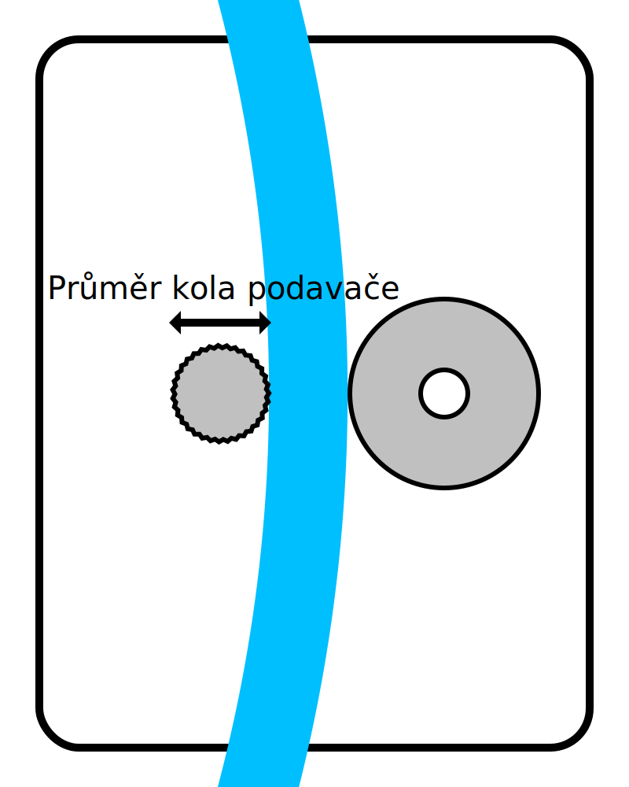

Průměr podávacího kola
====
Toto nastavení je velikost průměru kola, které pohybuje vláknem tam a zpět uvnitř podavače.

Toto nastavení Cura vůbec nepoužívá. Používá ho však plug-in X3GWriter pro správné ovládání podavače. Je třeba vědět, jak rychle pohnout podavačem, aby se vlákno posunulo na správnou vzdálenost.

*Protože se jedná o nastavení stroje, není toto nastavení normálně v seznamu nastavení viditelné.*