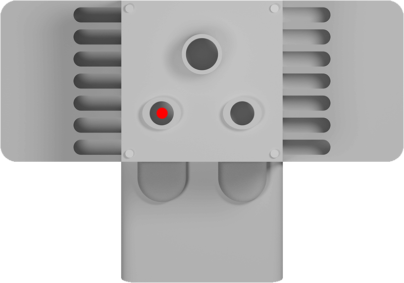

Polygon hlavy a ventilátoru stroje
====
Toto nastavení říká Cuře, jaký je tvar vaší tiskové hlavy při pohledu shora. To je nezbytné, aby se zabránilo kolizím při tisku v režimu [jeden po druhém](../blackmagic/print_sequence.md).

Toto nastavení obsahuje seznam souřadnic, které tvoří mnohoúhelník. Souřadnice jsou relativní k „poloze“ hlavy, ke které jsou trysky také relativně umístěny.

Cura to používá k vytvoření oblasti kolize kolem objektů, které tisknete, v režimu jeden po druhém. Tato oblast kolize vám neumožňuje umístit objekty příliš blízko u sebe, takže je nelze vytisknout bez toho, aby tisková hlava zasáhla dříve vytištěný model. Kolizní oblast však není stejného tvaru jako samotná tisková hlava: Bude to konvexní trup kolem tiskové hlavy, který zabrání kolizím i během pohybu. Bude také zmenšena, aby byla symetrická. Například, pokud je tryska více směrem k levé straně tiskové hlavy (jako na obrázku výše), bude oblast kolize zmenšena tak, že další objekt může být umístěn blízko pravé strany dříve vytištěných objektů. Pořadí, ve kterém jsou tyto objekty tisknuty, bude poté upraveno tak, aby mohly být vytištěny bez kolizí.

*Protože se jedná o nastavení stroje, nebude obvykle uvedeno v normálním seznamu nastavení. Velikost tiskové hlavy však lze hrubě zapsat v dialogu nastavení tiskárny, který se nachází v seznamu přidaných tiskáren v dialogu předvoleb. Můžete zadat pouze polohu vlevo, vpravo nahoře a dole na tiskové hlavě.*