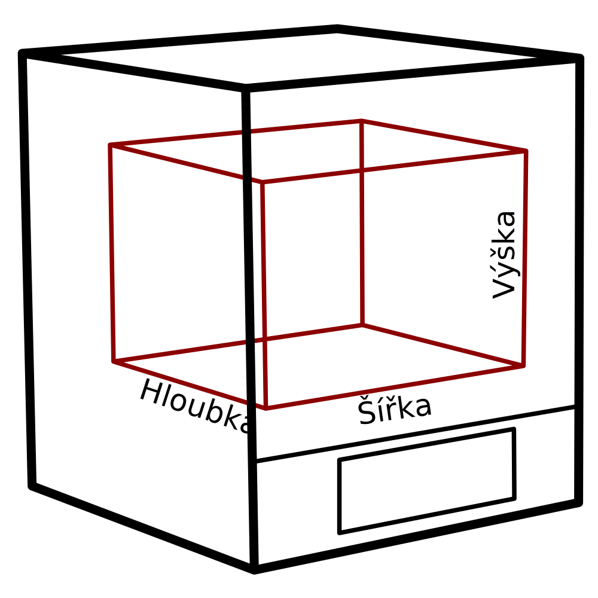

Výška zařízení
====
Toto nastavení označuje rozsah souřadnic Z, kterými se tryska může pohybovat. V zásadě jde o použitelný rozměr tiskárny.

To se nerovná skutečné výšce vaší tiskárny na polici. Skutečná tiskárna bude mít kolem svého objemu tisku také rám nebo rameno a tento rozměr tuto velikost nezahrnuje. Je to pouze souřadnice velikosti objemu tisku, kam se tryska může pohybovat.

**Protože se jedná o nastavení stroje, nebude obvykle uvedeno v normálním seznamu nastavení. Výšku lze změnit v dialogu nastavení tiskárny, který najdete v seznamu přidaných tiskáren v dialogu předvoleb.**