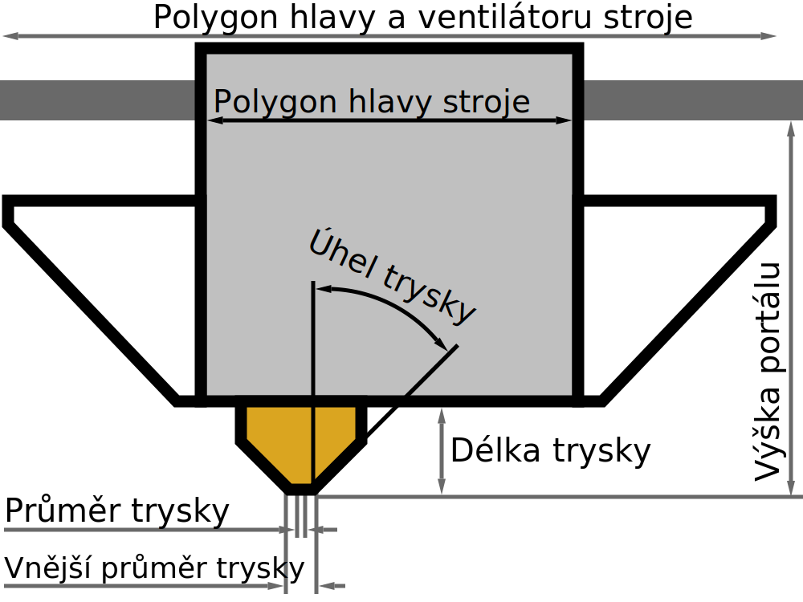

Úhel trysky
====
Toto nastavení obsahuje měření úhlu špičky trysky ve stupních. Nižší úhel znamená, že hrot je velmi ostrý. Vyšší úhel znamená, že hrot je tupý.

Tento úhel se používá k určení vůle mezi sousedními vzpěrami při použití [drátového tisku](../experimental/wireframe_enabled.md). Pokud je tryska velmi tupá, musí být vertikální vzpěry rozmístěny velmi daleko od sebe, aby se zabránilo tomu, aby tryska zasáhla ostattní vzpěry.

**Protože se jedná o nastavení stroje, není toto nastavení normálně v seznamu nastavení viditelné.**