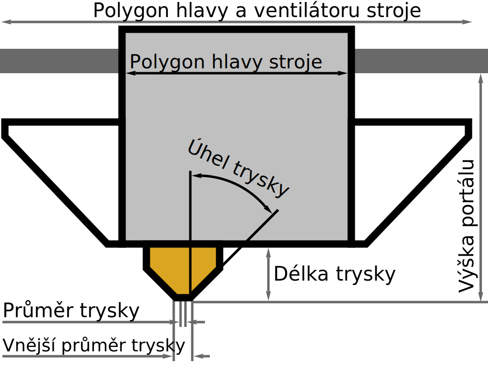

Délka trysky
====
Toto nastavení obsahuje vzdálenost mezi špičkou trysky a hlavním tělem tiskárny.

Toto nastavení nepoužívá Cura, ale profily ho mohou použít k určení hodnot pro jiná nastavení, například [výšky připojení pro drátový tisk](../experimental/wireframe_height.md).

**Protože se jedná o nastavení stroje, není toto nastavení normálně v seznamu nastavení viditelné.**