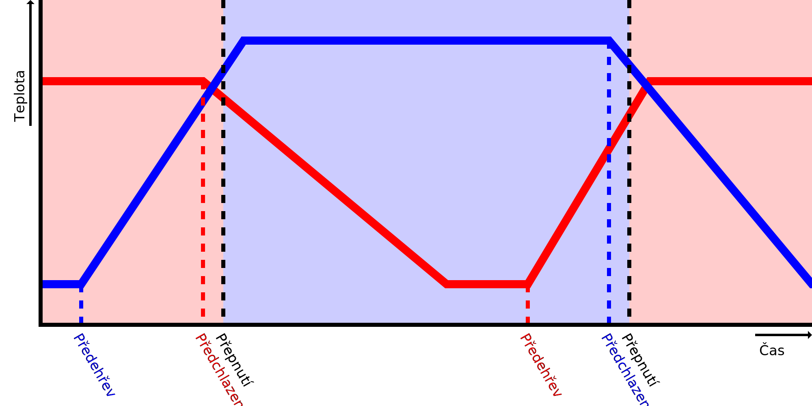

Rychlost ohřevu
====
Toto nastavení říká Cuře, jak rychle může vaše tiskárna zahřát tuto trysku. Slouží k předpovědi, kdy začít trysku předehřívat před přepnutím extrudérů.

Když přepínáte trysky, Cura začne předehřívat další trysku před tím, než ji bude potřeba použít, takže je připravena k použití, když je právě dokončen předchozí extrudér. Aby to bylo dosaženo, bude zapotřebí rozdílu mezi aktuální teplotou trysky a cílovou teplotou trysky a vydělit ji rychlostí zahřívání, aby se dosáhlo doby, po kterou se tryska předehřeje.

Pokud se tryska zahřeje rychleji, než to, co naznačuje toto nastavení, zůstane tryska chvíli na cílové teplotě, než se dotiskne předchozí extrudér. Během této doby vyteče nějaký materiál a plast by se mohl trochu v trysce degradovat, což by mělo za následek [pod-extruzi](../troubleshooting/underextrusion.md).

Pokud se tryska zahřeje pomaleji, než je uvedeno v tomto nastavení, bude tiskárna muset počkat na spínači extrudéru, dokud tryska nebude mít požadovanou teplotu pro tisk. Bude to trvat déle. Kromě toho bude předchozí extrudér během tohoto čekání také udržován na konečné tiskové teplotě, což povede k tomu, aby vytékalo více materiálu a znovu se degradoval plast v trysce. To je nezbytné k tomu, aby se zabránilo dalšímu ochlazení materiálu, pod hodnotu, kterou Cura očekávala během slicování, což by způsobilo větší teplotní rozdíl, než který Cura očekávala, a příště tak povede k ještě delší čekací době. To by mělo za následek efekt útěku, kdy se předpověď zhoršuje s každou vrstvou, takže Cura musí udržovat předchozí materiál v teple, dokud není dosaženo teploty druhé trysky.

Skutečná rychlost zahřívání není konstantní rychlost ve stupních za sekundu. Pravděpodobněji to bude záviset na rozdílu mezi aktuální teplotou trysky a teplotou tiskového objemu. Jako taková se bude zahřívat rychleji, když je chladná, a když se blíží cílové teplotě, bude se ohřívat pomaleji. Velkou roli v tom hraje také regulátor PID tiskárny. Většina regulátorů zpomalí ohřev těsně před dosažením cílové teploty, aby se zabránilo jejímu překročení. Pokud toto ladíte, zkuste to naladit změřením času potřebného k zahřátí z [pohotovostní teploty](../material/material_standby_temperature.md) na [počáteční teplotu tisku](../material/material_initial_print_temperature.md). Toto je nejdůležitější stopa, kterou se Cura pokusí předpovědět. Při malých tiscích byste mohli mírně snížit rychlost zahřívání a nastavit tak, aby se nespustilo z pohotovostní teploty, ale z vyšší teploty.

**Protože se jedná o nastavení stroje, není toto nastavení normálně v seznamu nastavení viditelné.**