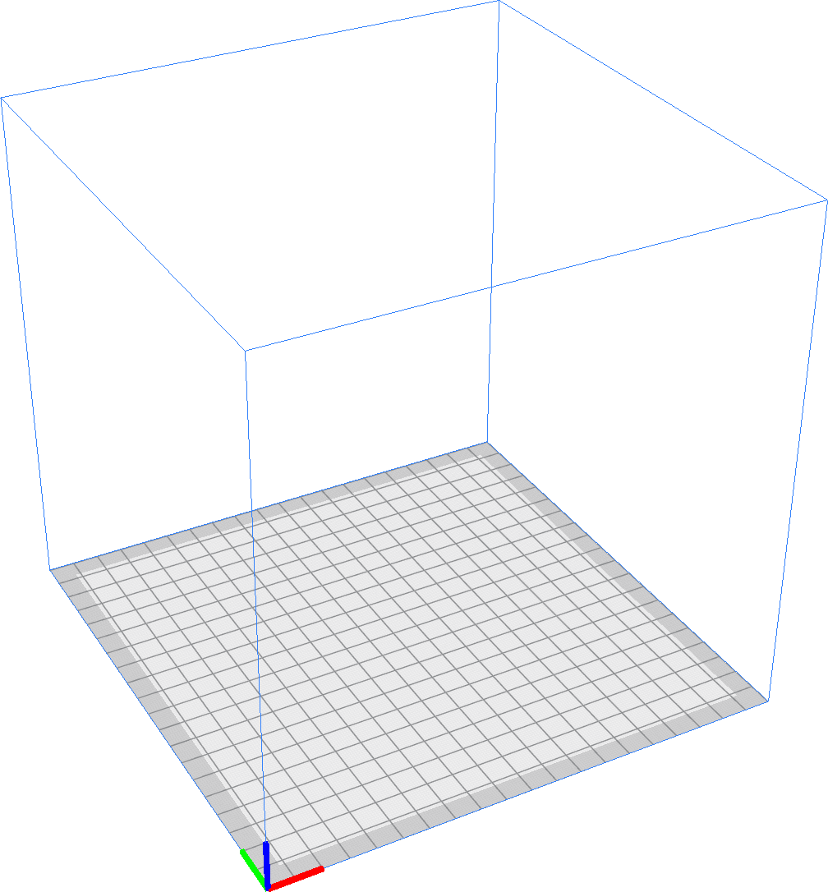

Tvar tiskové plochy
====
Pomocí tohoto nastavení můžete určit tvar, který tisknutelný objem zaujme v tiskárně. Existují dvě možnosti: obdélníkový nebo eliptický.

Eliptický objem tisku je běžný u 3D tiskáren ve stylu delta. Pokud je podložka tisku eliptická, [šířka](machine_width.md) a [hloubka](machine_depth.md) tiskového objemu platí pro dva poloměry elipsy. Cura dovolí umísťovat objekty pouze do elipsy, takže celkový objem tisku bude menší, ve srovnání s obdélníkovou deskou se stejnými rozměry.

*Toto nastavení je nastavení stroje, takže se neobjeví v normálním seznamu nastavení. Lze ho změnit tak, že přejdete na seznam tiskáren v okně předvoleb a kliknete na „Nastavení stroje“.*