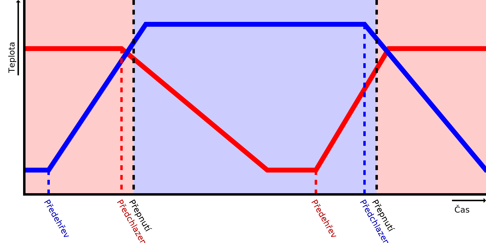

Konečná teplota tisku
====
Těsně před přepnutím na jiný extrudér se tryska nechá mírně ochladit na konečnou teplotu tisku. Ve skutečnosti se tedy tryska ochladí dříve, než extrudér dokončí tisk. Začne se ochlazovat, když tryska dosáhne konečné tiskové teploty přesně před výměnou extrudéru. Poté bude pokračovat v ochlazování na pohotovostní teplotu.

Pokud je konečná teplota tisku o něco nižší než normální teplota tisku, nevytéká z tryska tolik materiálu, když čeká v pohotovostním režimu, zatímco tiskne druhý extrudér.