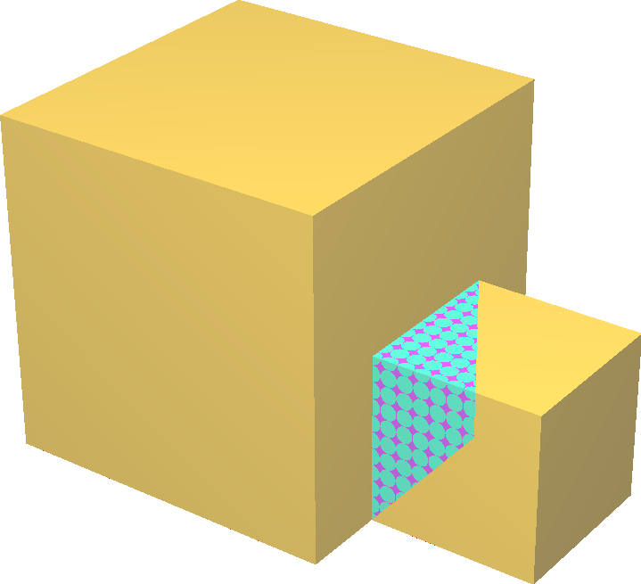

Extenzivní sešití
====
Cura potřebuje vědět, kde je interiér modelu, aby ho vyplnil materiálem. Pokud povrch vašeho modelu není přesně uzavřen nebo má vnitřní stěny, může být nejednoznačné, kde se interiér modelu nachází.

Častým případem nedestrukčního modelu je případ, kdy je další část modelu připojena k jinak uzavřené části. Tento případ je častý při úpravách sítí pomocí CAD softwaru, který nebyl navržen pro výrobu (ale pouze pro digitální vykreslování), jako je Blender nebo SketchUp. Na obrázcích níže můžete vidět příklad.

Toto nastavení umožňuje aplikaci Cura pokusit se lépe zaplnit mezery v síti, pokud není správně vodotěsná. Tím se zvyšuje šance na získání dobrého tisku, ale zvyšuje se doba slicování a někdy se mohou spojit dohromady špatné povrchy.
