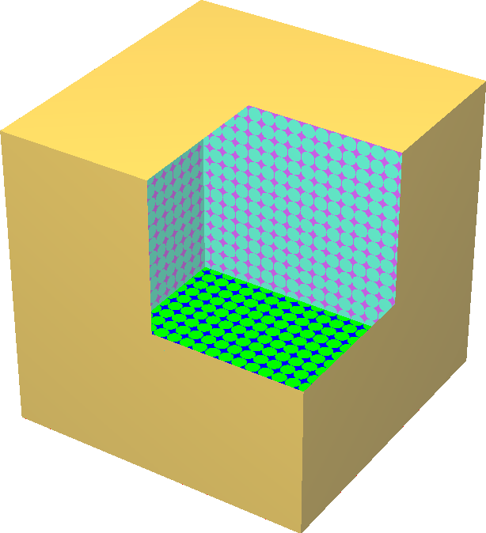

Ponechat otevřené povrchy
====
Cura potřebuje vědět, kde je interiér modelu, aby ho vyplnil materiálem. Pokud není model vodotěsný, je to nejednoznačné. Cura obvykle netiskne části, které nejsou správně uzavřeny.

Pokud je tento parametr aktivován, budou zachovány vrstvy, jejichž obvod není správně uzavřen. Obvod bude uměle uzavřen přímou čarou. To může pomoci opravit některé modely, které mají na povrchu malé mezery. Může však také poskytnout špatnou interpretaci interiéru vašeho modelu.

Rentgenové zobrazení ukáže červeně mezery, které lze tímto nastavením vyplnit.
