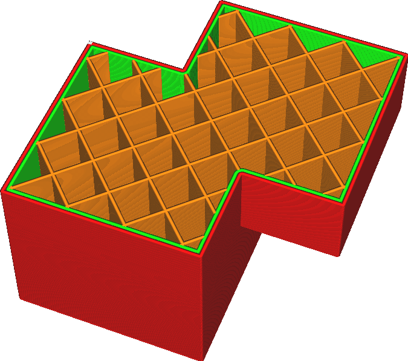

Sjednotit překrývající se svazky
====
Pokud model obsahuje více svazků, které se protínají, objem, který je uvnitř obou svazků, se obvykle nenaplní. Toto nastavení způsobí, že Cura ignoruje vnitřní struktury a vyplňuje všechny, bez ohledu na to, kolik skořepin je kolem svazku.

Z technického hlediska toto nastavení účinně upravuje pravidlo navíjení ze [sudý lichý](https://en.wikipedia.org/wiki/Even%E2%80%93odd_rule) na [nenulový](https://en.wikipedia.org/wiki/Nonzero-rule). Normálně je svazek vyplněn, pokud je obklopen lichým počtem skořepin. Když je tento parametr aktivován, je vyplněn, pokud je obklopen nenulovým počtem skořepin.

*Toto funguje pouze pro svazky ve stejném modelu. Pokud jste načetli více souborů a nechali je v aplikaci Cura protínat, nebude mít toto nastavení žádný účinek. Chcete-li vyřešit problémy s překrývajícími se několika samostatnými sítěmi, podívejte se na parametr Odstranění průniku sítí.*
