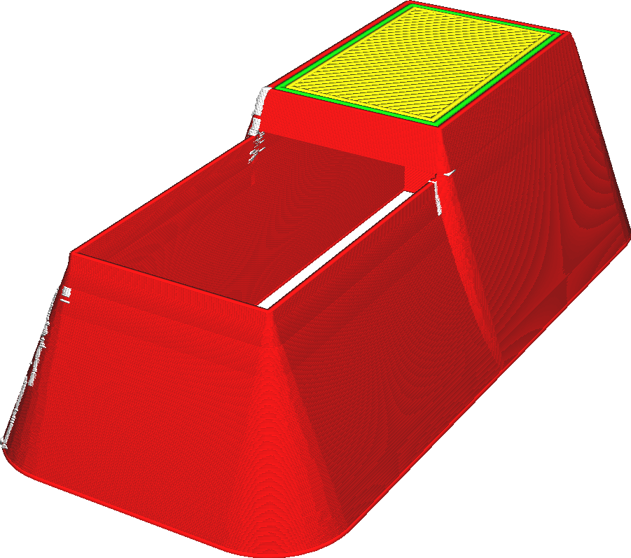
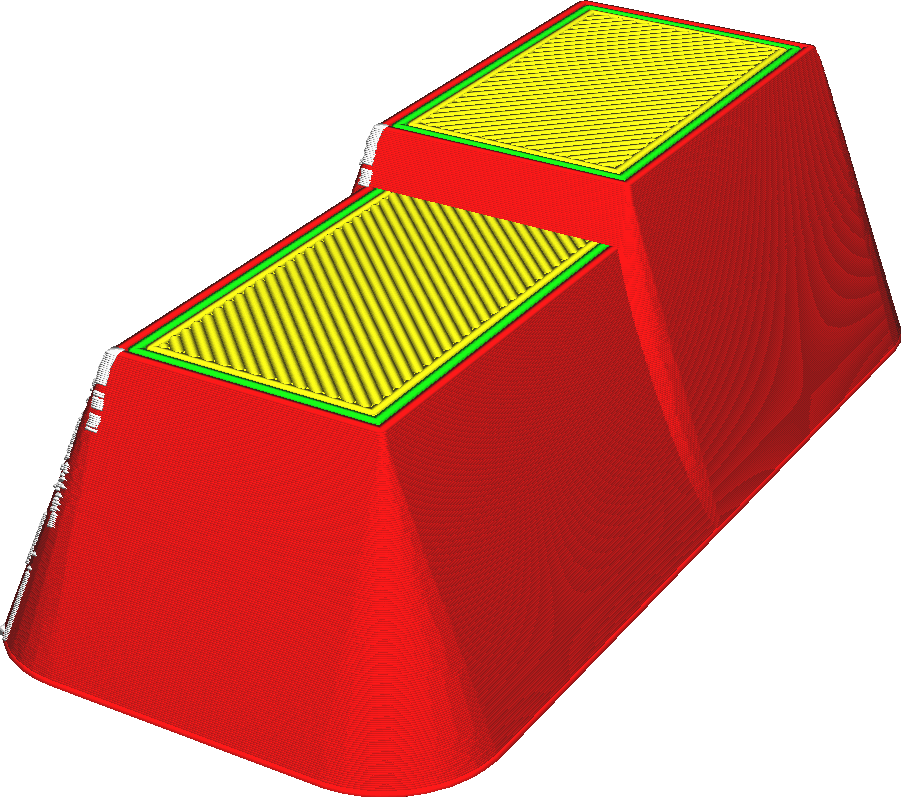

Odstranit všechny otvory
====
Některé modely, zejména ty, které jsou určeny pro výrobní techniky, jako je vstřikování, mají tendenci mít vnitřní dutiny, které nejsou viditelné. Pokud je tento parametr aktivován, Cura tyto vnitřní dutiny odstraní.

Dutiny uvnitř mohou být navrženy tak, aby šetřily materiál, ale s 3D tiskem určitá omezení způsobují, že se tyto modely tisknou méně dobře. Například 3D tiskárny nefungují dobře u tenkých stěn, které nejsou násobkem šířky linie, a horní plášť má tendenci se prohýbat, pokud není podpírán výplní. Obvykle je nejlepší vytvořit pevnou síť a nechat slicer rozhodnout, jak ji naplnit. Tento parametr fixace otvoru vám to umožní, aniž byste museli síť upravovat.

Cura se bude dívat pouze horizontálně, zda je dutina zcela uzavřena. Nebude se dívat, zda je dutina přístupná shora nebo zdola. Rozdíl může být stále shora nebo zdola patrný.
