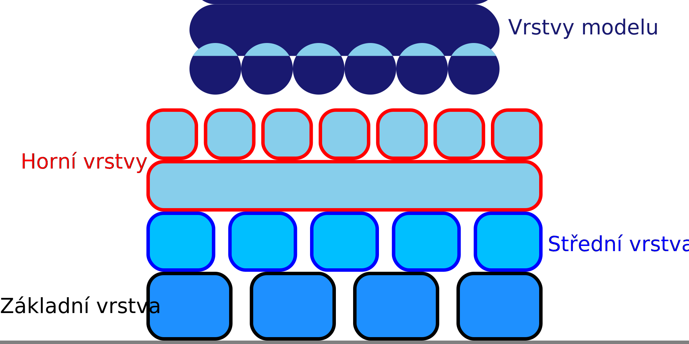

Extrudér pro střední vrstvy raftu
====
Tímto nastavením se vybere extrudér, který se použije pro střední vrstvy raftu.

Vrstvy rozhraní jsou vnořeny mezi základní vrstvu a vrchní vrstvy. Fungují jako nárazníková zóna, která udržuje teplo z konstrukční desky mimo horní vrstvy, poskytuje určitou strukturální pevnost a podporuje horní vrstvy lépe, než by to dokázala základní vrstva. Proto je důležité vybrat materiál, který dobře přilne k materiálům v základní a vrchní vrstvě.