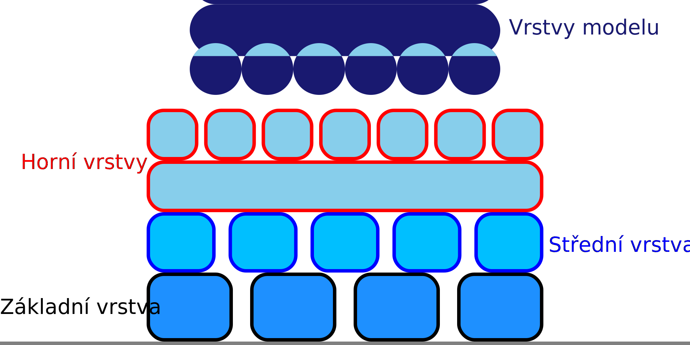

Rychlost ventilátoru střední vrstvy raftu
====
Toto nastavení umožňuje konfigurovat rychlost ventilátoru při tisku střední vrstvy raftu. Rychlost ventilátoru při tisku střední vrstvy lze konfigurovat odděleně od rychlosti ventilátoru pro základní a horní vrstvu.

Je užitečné nakonfigurovat Rychlost ventilátoru zvlášť pro střední vrstvu, protože snížení rychlost ventilátoru může zlepšit přilnavost k lůžku a snížit deformaci. Zvýšení rychlosti ventilátoru může zlepšit hladkost povrchu, ale to není problém pro střední vrstvu. Proto je vhodné nastavit rychlost ventilátoru o něco níže než v horních vrstvách.
