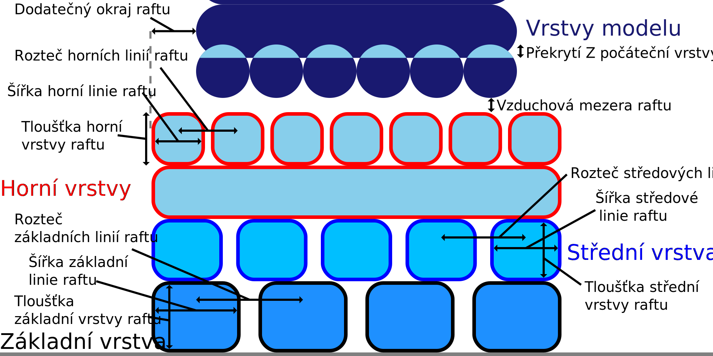

Tloušťka střední vrstvy raftu
====
Toto nastavení umožňuje upravit vertikální tloušťku střední vrstvy raftu.

Silnější vrstva raftu vede k tomu, že je raft trochu tužší. Tím se zabrání ohýbání během tisku i po něm. Během tisku musí být raft tuhý, aby se nedeformoval, což narušuje přilnavost k tiskové podložce a způsobuje spojení voru s modelem. Po tisku budete chtít, aby byl raft pružný, abyste ho mohli snadněji oddělit od tisku. Toto je rovnováha, která musí být pro tuto úpravu nalezena.