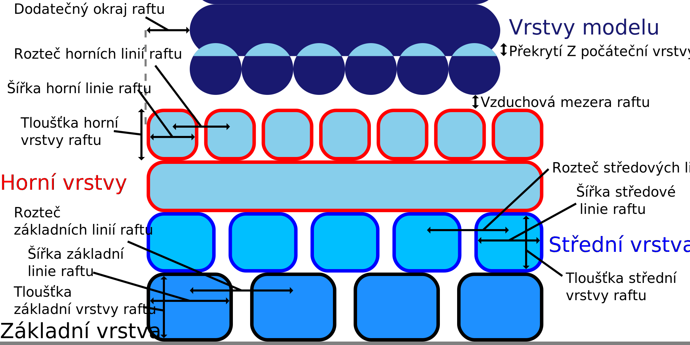

Horní vrstvy raftu
====
Toto je počet vrstev v horní části raftu. Vždy bude existovat základní vrstva a střední vrstva, ale může existovat libovolný počet horních vrstev. Tyto horní vrstvy jsou obvykle velmi husté, aby vytvořily hladký povrch, na který může být model vytištěn.

Více vrstev umožňuje hladší povrch pro tisk modelu, protože řídce vyplněná základní a střední vrstva musí být přemostěna. Hladší povrch vylepšuje spodní stranu tisku a zvyšuje přilnavost mezi raftem a modelem

Tisk více vrstev však také trvá mnohem déle.
