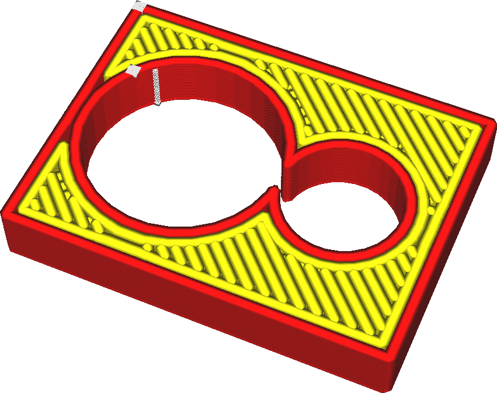

Šířka linie
====
Toto je horizontální šířka linií, které tiskárna položí. Průměr otvoru trysky obvykle určuje šířku linií, ale vytlačením více či méně materiálu může tiskárna šířku linií mírně měnit.

Zmenšení šířky linie umožňuje tiskárně tisknout více podrobností. Zejména to také umožňuje tiskárně tisknout jemné součásti. Jedním z nejvlivnějších parametrů tisku je šířka linie. Zde jsou některé z efektů:
* Tisk tenčích linií umožní tisk tenčích dílů, protože se vejdou i do nejtenčích součástí.
* Úpravou šířky linie na násobek tloušťky vašeho tisku může být objekt pevnější a zlepší se tok materiálu.
* Menší šířka linie způsobí, že váš horní povrch bude plynulejší.
* Tiskové linie o něco menší, než je velikost vaší trysky, mají tendenci zvyšovat odolnost. To umožňuje, aby tryska sloučila sousední linie dohromady, když udělá druhý průchod mírně vyšší než předchozí linie.
* Příliš široké tiskové řádky způsobují podextruzi. Tiskárna se bude snažit vytlačit více materiálu, aby vyplnila požadovanou šířku linie. Tento materiál se bude snažit proudit jakýmkoli směrem. V jednom bodě se však protitlak stává příliš velkým, takže materiál již neteče na okraj velmi širokých linií. To pak ponechá mezi liniemi mezery.
* Příliš malé tiskové linie také způsobují podextruzi. Pokud materiál neprotéká tryskou dostatečně rychle, povrchové napětí materiálu způsobí jeho srážení do malých kapiček, což způsobí nerovnoměrné vytlačování a ponechání mezer mezi kapičkami.
* Tisk tenčích linií dramaticky prodlouží dobu tisku.

Nedoporučuje se snižovat šířku linií pod 60% velikosti trysky nebo nad 150%. V obou případech nemusí být materiál dostatečně vytlačován.

<!--if cura_version>=5.0-->U tenkých dílů se šířka linie automaticky upraví tak, aby odpovídala místní šířce dílu. Není třeba zajišťovat, aby šířka dílu byla násobkem šířky linie. Parametr [Prahový úhel přechodu mezi stěnami](../shell/wall_transition_angle.md) určuje, kde se šířka čáry automaticky v ostrých rozích upraví. Parametr [Minimální šířka linie stěny](../shell/min_wall_line_width.md) určuje, jak dalece se mohou v jednotlivých směrech upravovat.<!--endif-->

<!--if cura_version<5.0:
Nastavení šířky linií pro uložení dostatečného počtu stěn
----
Při tisku mechanických objektů, které by měly být tenké, ale pevné, se pravidelně setkáváte s problémem, že vaše součást není čistým násobkem šířky linie. Pokud to není násobek, Cura normálně sníží tok určitých linií kvůli nastavení parametru [Kompenzovat překrytí stěn](../shell/travel_compensate_overlapping_walls_enabled.md). Tím se mění průtok tryskou, což ovlivňuje vizuální kvalitu. Pokud je to čistý násobek šířky linie, ale nikoli sudé číslo, bude jedna ze stěn snížena na 0.

Vytváření ostrých obrysů se stejnými liniemi může tisk zesílit a zkrátit. Jednou z hlavních dovedností jakéhokoli zkušeného uživatele Cury je schopnost upravit šířku linie tak, aby požadovaný počet kontur vyplnil tisk.

-->
Udržování konstantního průtoku
----
Velké výkyvy v toku jsou někdy pro FDM tiskárny problematické. Komora trysky udržuje část materiálu pod tlakem, což zpožďuje skutečný průtok na výstupu z trysky. Trvá chvíli, než se tok zvýší nebo sníží. Tiskárny vybavené bowdenovým systémem pro podávání vlákna mají také pružinový efekt v trubce bowdenu, což tento efekt ještě zhoršuje. Výsledkem bude podextruze, když jdete na vyšší průtok a nadextruzi, když jdete na nižší průtok. To je důvod, proč je dobré udržovat tok co nejvíce konstantní.

Šířka linie výrazně ovlivňuje tok. Je vhodné udržovat šířky linií blízko sebe a blízko k velikosti trysky. Pokud je šířka linie velká, můžete také zvážit úpravu rychlosti tisku, aby byla průtok konstantní. Tím se zlepší rozměrová přesnost tisku.