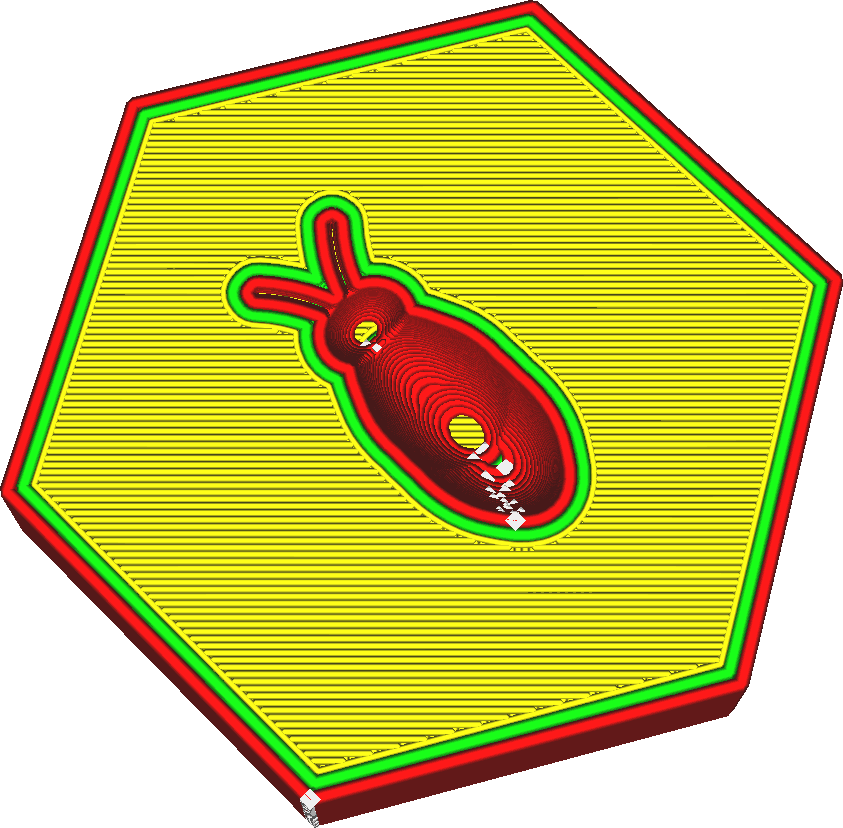

Šírka linie stěny
====
Šířku linií stěny lze nastavit odděleně od zbytku tisku. Toto nastavení označuje šířku jednotlivých linií stěny.

Je známo, že zmenšení na šířky linie stěn na hodnotu o něco menší, než je velikost trysky, je výhodné pro pevnost. Tryska bude vytlačovat o něco méně materiálu, ale její otvor bude překrývat sousední linie stěny. Materiál je poté tlačen zpět stěnou, dříve umístěnou na správném místě. Ale také umožňuje, aby se plast lépe spojil se sousedními stěnami. To umožňuje, aby se stěny lépe sloučily, takže mohou sloučit svou sílu. To výrazně zlepšuje odolnost stěn.

Zmenšení šířky linií stěny také umožňuje, aby tryska tiskla jemnější detaily. Pro tuto vlastnost je zvláště důležitý parametr [Šířka linie vnější stěny](wall_line_width_0.md).

Zvětšení šířky linie stěny může zkrátit dobu tisku. Budete potřebovat méně linií stěn, abyste získali díly podobné síly. Pevnost však bude poněkud snížena, protože sousední stěny se nebudou spolu tolik spojovat.

Přizpůsobení linií
----
Při tisku jemných součástí je nastavení šířky linie stěny důležitým nástrojem pro získání přesných a pevných dílů. Cura nakreslí pouze celé obrysy, takže pokud se obrys nevejde, vloží se do stěny mezera, což výrazně snižuje odolnost a přesnost součásti.

Cura se pokusí vyplnit tyto mezery mezi stěnami, pokud je povolena možnost [Vyplnit mezery mezi stěnami](../shell/fill_perimeter_gaps.md), ale tato technika není zdaleka ideální pro libovolné tvary a často trvá tisk dlouho. Když se dvě stěny překrývají, funkce [Kompenzovat překrytí stěn](../shell/travel_compensate_overlapping_walls_enabled.md) zmenší šířku linií stěny, aby byla zajištěna rozměrová přesnost součásti, ale to způsobí změny toku, která také snižují kvalitu a odolnost tisku.

Pro ideální uložení musí být díl přesným násobkem šířky linie stěny tak, aby stěny přesně zapadaly do součásti. Pokud znáte šířku svého dílu, lze to snadno provést úpravou šířky stěn. Nejprve uvidíte, kolik obrysů chcete upravit tak, aby linie byly stále přiměřené šířky. Pak uvidíte, o kolik musíte upravit šířku linií stěny, aby linie správně zapadly. Mějte na paměti, že můžete upravit [šířku linie vnější stěny](wall_line_width_0.md) a [šířku linie vnitřní stěny](wall_line_width_x.md) samostatně. Pečlivě spočítejte, kolikrát bude nakreslen každý typ stěny, aby bylo možno předpovědět účinek změny šířky linie stěny.

Přizpůsobení linií stěn je důležitou dovedností pro 3D tisk, který odlišuje odborné operátory 3D tiskáren od ostatních. Je nutná určitá praxe.
