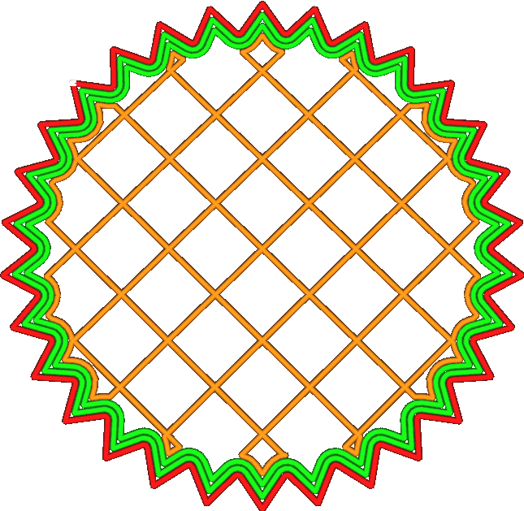

Střídavě další stěna
====
Toto nastavení přidává další stěnu na každou další vrstvu. Tímto způsobem je výplň nalepena svisle mezi stěnami, což poskytuje silnější výtisk..

Pokud například nastavíte počet linií stěn na dvě stěny a aktivujete možnost "Alternativní další stěna", budou vytištěny dvě stěny na sudých vrstvách a tři stěny na lichých vrstvách.

Povolení tohoto nastavení zabere další čas, přibližně polovinu času, než by zabralo přidání další stěny. V některých ohledech je tato střídavá dodatečná stěna téměř stejně dobrá jako plná dodatečná stěna a v některých ohledech není:
* Výrazně zvyšuje vazbu mezi výplní a stěnami, protože linie výplně mohou vertikálně přiléhat i k další stěně nad a pod nimi. V tomto ohledu dodatečná stěna překonává svou váhovou kategorii. Je velmi účinná.
* Přidává tisku na tuhosti jako polovina stěny navíc. Tím, že přiléhá k sousední stěně, rozkládá napětí na více vláken a poskytuje větší rameno proti silám ve vodorovném směru. Střídavá přídavná stěna k tomu nemá zvláštní výhodu, ani zvláštní nevýhodu.
* Skutečná dodatečná stěna by také zvýšila pevnost spojení vrstev. Stěny se tisknou pomalu, takže jsou hlavním zdrojem pevnosti spojení vrstev. Střídavá přídavná stěna se však nespojuje se sousedními vrstvami, protože se vyskytuje pouze v každé druhé vrstvě.

V důsledku toho je střídavá přídavná stěna účinným způsobem, jak přidat vodorovnou tuhost, ale neúčinným způsobem, jak přidat svislou houževnatost.