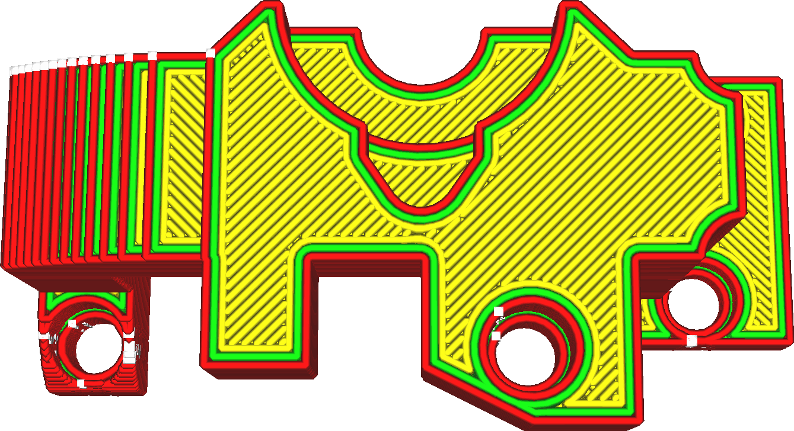

Povolit žehlení
====
Žehlení nutí tiskárnu, aby udělala nový průchod na horním povrchu, aby byl ještě hladší. Tento průchod navíc má velmi malou šířku linie a tiskne velmi pomalu.

Žehlení umožňuje tisknout lineární vzor na horní povrch vašeho tisku. To má dva hlavní příznivé účinky:
* Toto znovu roztaví horní povrch tím, že přes něj několikrát projde horkou tryskou. Odtud pochází název „žehlení“. Rychlost pohybu je velmi nízká a šířka linie je velmi malá, tryska povrch výrazně ohřívá. Plochá část trysky ji pak vyhladí.
* Vyplňuje mezery v horní ploše. Žehlící pohyb se provádí ve stejné výšce jako samotná vrstva. Má menší průtok než plná vrstva, ale stále má určitý tok. Teoreticky tento tok nemá kam jít, ale v praxi udržuje tlak uvnitř tryskové komory. Kdykoli tryska prochází nepravidelností povrchu, materiál v trysce proudí do tohoto prostoru.

Žehlení však má i několik nevýhod:
* Výrazně to zvyšuje dobu tisku.
* Pokud má žehlení vzor přerušení (protože se musí přesunout do různých částí), zanechá viditelnou linii mezi částí, která byla dříve vyžehlena a částí, která byla vyžehlena později. Tomu lze někdy zabránit nastavením parametru [Vzor žehlení](ironing_pattern.md) na jiný, například soustředný.
* Nakloněné povrchy nebo horní povrchy se spoustou detailů lze také vyžehlit, což zvyšuje topografický efekt. Hranice mezi vrstvami jsou výraznější. Tomu lze zabránit aktivací funkce [Žehlit pouze nejvyšší vrstvu](ironing_only_highest_layer.md).

