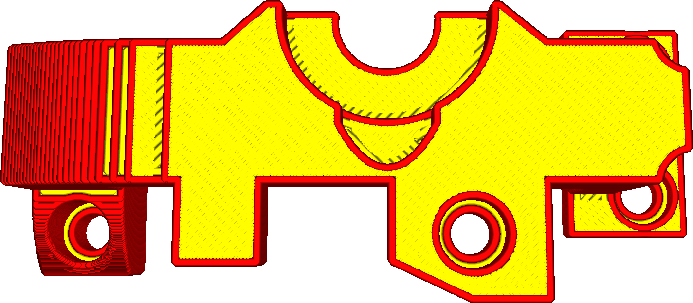

Tok pro žehlení
====
Žehlení zahrnuje umístění dalších linií na povrch, což je technicky pře-extrudování. Toto nastavení řídí množství vytlačovaného materiálu během tohoto dalšího průchodu. Tok je nutné pro vyplnění mezer v povrchu.

Tento parametr musíte nastavit dostatečně vysoko, abyste udrželi tlak na trysce. Tento tlak musí vyplnit mezery horní plochy. Pokud máte velmi drsný povrch (z důvodu deformace nebo rychlému tisku), bude pravděpodobně nutné toto nastavení zvýšit.
