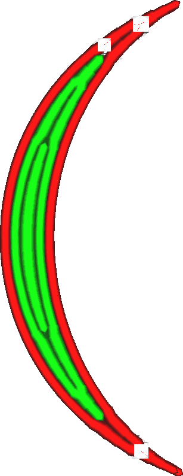

Minimální šířka linie sudé stěny
====
Při tisku tenkých dílů přizpůsobí Cura šířku linií stěn tak, aby přesně odpovídaly šířce modelu. Cura se také může rozhodnout, že místo toho použije menší počet linií stěny. Toto nastavení představuje hranici, při které Cura spojí dvě linie do jedné. Lze ji nastavit odděleně od nastavení [prahové hodnoty, při které se odstraní prostřední linie](min_odd_wall_line_width.md).

Sudé vs. liché linie
----
Toto nastavení umožňuje upravit práh pro odstraňování linií zejména při sudém počtu linií. To je případ, kdy jsou uprostřed dvě linie a ne jedna. Určuje, kdy se tyto dvě linie uprostřed spojí do jedné linie.

Minimální šířka sudé linie stěny se může lišit od minimální šířky linie liché stěny kvůli způsobu jejich spojení. Sudé linie se na svých koncích spojují tak, že se jejich konce k sobě přibližují. Tam dochází k určitému překrývání těchto linií, což vede k jejich nadextruzi. To se liší od situace, kdy je počet linií stěny lichý: Linie uprostřed se pak prostě zastaví a v tisku zůstane mezera. Zmenšení minimální šířky linie sudých stěn snižuje přesah na přechodech ze sudých do lichých linií. Zmenšení minimální šířky linie liché stěny zmenšuje velikost mezery na přechodech z lichých linií do sudých.

Mezery vzniklé při ukončení liché linie jsou v konečném výsledku viditelnější než malé přesahy ve spoji, proto by mohlo pomoci nastavit minimální šířku linie sudé stěny o něco větší než minimální šířku linie liché stěny.

Snížení tohoto nastavení vede k:
* Zmenšení oblasti překryvu v místech, kde se dvě linie spojují do jedné linie.
* Zmenšení maximální šířky jednotlivých středových linií.
* Tenčí linie, které se nemusí dobře vytlačovat.
* Více linií, jejichž tisk trvá déle.

**Toto nastavení se netýká pouze běžných stěn, ale také dodatečných stěn, podpůrných stěn, výplňových stěn a soustředných vzorů.**