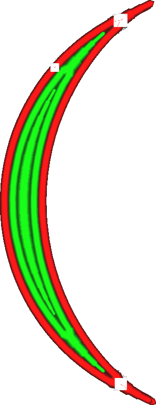

Minimální šířka linie liché stěny
====
Při tisku tenkých dílů přizpůsobí Cura šířku linií stěn tak, aby přesně odpovídala šířce modelu. Cura se také může rozhodnout, že místo toho použije menší počet linií stěn. Toto nastavení představuje hranici, při které Cura odstraní linii uprostřed. Lze ji nastavit odděleně od nastavení [prahové hodnoty, při které se spojí dvě středové linie](min_even_wall_line_width.md).

Sudé vs. liché linie
----
Toto nastavení umožňuje upravit práh pro odstraňování linií zejména v případě lichého počtu linií. To znamená, že uprostřed je jedna linie a ne dvě. Určuje, kdy se tato jediná linie odstraní ve prospěch toho, aby dvě linie kolem ní byly o něco širší.

Minimální šířka liché linie stěny se může lišit od minimální šířky sudé linie kvůli způsobu jejich přechodu. Když je lichá linie odstraněna, zastaví se před přechodem a nechá okolní stěny přiblížit. Během přechodu vznikne malá mezera, ve které se okolní linie ještě zcela nespojily. To se liší od situace, kdy je počet stěn sudý: Dvě linie uprostřed se pak srazí k sobě a mírně se překrývají. Zmenšením minimální šířky liché linie stěny se zmenší velikost mezery na přechodech z lichých linií na sudé. Zmenšení minimální šířky sudé linie stěn snižuje velikost přesahu na přechodech ze sudých do lichých linií.

Mezery vzniklé při ukončení liché linie jsou v konečném výsledku viditelnější než malé rozšíření v místě spoje, proto by mohlo pomoci nastavit minimální šířku liché linie o něco menší než minimální šířku sudé linie.

Snížení tohoto nastavení vede k:
* Menší mezery při ukončení centrální linie.
* Menší maximální šířka dvojice sudých středových linií.
* Tenčí linie, které se nemusí dobře vytlačovat.
* Delší linie, jejichž tisk trvá déle.

**Toto nastavení se netýká pouze běžných stěn, ale také dodatečných stěn, podpůrných stěn, výplňových stěn a soustředných vzorů.**