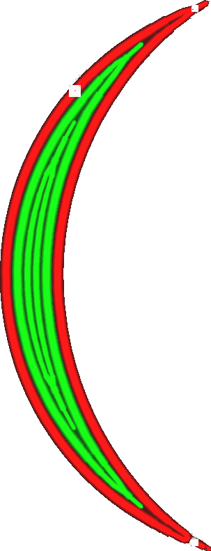

Minimální šířka linie stěny
====
Při tisku tenkých dílů přizpůsobí Cura šířku linií stěn tak, aby přesně odpovídaly šířce modelu. Cura se také může rozhodnout, že místo toho použije menší počet linií stěn. Toto nastavení rozhoduje o hranici, při které se Cura rozhodne odstranit stěnu namísto ztenčení stávajících stěn.

Rozdílný počet stěn
----
Pokud existuje jediná centrální linie a [Počet rozdělení na stěnách](wall_distribution_count.md) je nastaven na hodnotu 1, funguje toto nastavení přesně tak, jak je uvedeno. Pokud je středová linie tenčí než stanovená šířka, odstraní se ve prospěch rozšíření ostatních linií. V ostatních případech je výpočet složitější.

Přesný výpočet je složitý, ale intuitivní pochopení může být užitečné. V podstatě můžete jednoduše vydělit celkovou šířku modelu [šířkou běžné linie](../resolution/wall_line_width.md) a získat tak určitý počet stěn. Může se však jednat o zlomek (např. 5,3 šířky linie stěny). Minimální šířka linie stěny vezme právě tuto zlomkovou část (0,3 šířky linie) a přidá další stěnu, pokud přesahuje minimální šířku linie stěny. Se známým počtem stěn pak určí šířku každé z linií podle Počtu rozdělení stěn.

V podstatě to znamená, že pokud je více linií, jejichž šířka se upravuje, šířka linie nikdy nebude tak extrémní, jak by umožňovala minimální šířka linie stěny. Pokud jsou například upraveny prostřední dvě linie, šířka linie neklesne pod průměr normální šířky linie a Minimální šířky linie stěny.

Nastavení lze zvlášť vyladit pro [sudý](min_even_wall_line_width.md) a [lichý](min_odd_wall_line_width.md) počet stěn. Samostatným případem je také 0 stěn, které lze vyladit pomocí nastavení [Minimální velikost prvku](min_feature_size.md).

Vyladění
----
Nastavení této hodnoty na 50 % šířky linie teoreticky zajistí, že šířka linie zůstane co nejblíže běžné šířce linie. Je však lepší zůstat o něco výše. Pro tiskárnu je snazší tisknout linie širší, než je velikost trysky, než tisknout tenčí linie, a mít méně linií také znamená, že tisk bude rychlejší.

U velmi viskózních materiálů nebo při rychlejším tisku je třeba snížit minimální šířku linie stěny, aby se zabránilo vytváření příliš širokých linií. Ty se špatně tisknou, pokud materiál nestihne dostatečně vytéct do stran. Pokud je Minimální šířka linie stěny příliš vysoká, stěny se k sobě dobře nedrží, což způsobuje křehkost tisku.

**Toto nastavení se netýká pouze běžných stěn, ale také dodatečných stěn, podpůrných stěn, výplňových stěn a soustředných vzorů.**