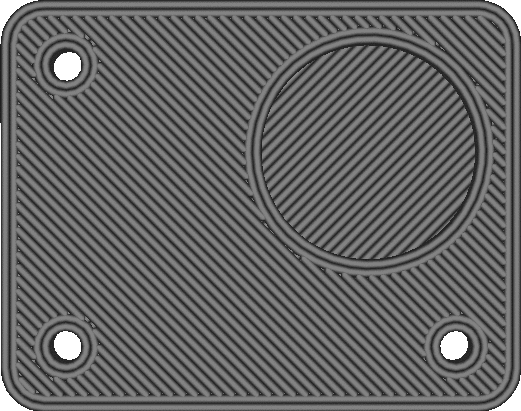

Optimalizovat pořadí tisku stěn
====
Pokud je tato funkce aktivována, Cura věnuje další čas slicování, pro optimalizaci pořadí, ve kterém jsou stěny tisknuty. Cílem je snížit počet přesunů a přesunů, tiskem stěn, které obklopují stejný díl, jednu po druhé.

Pokud je tato optimalizace povolena, tryska nejprve vytiskne všechny stěny kolem jednoho dílu před přesunem do další díl, namísto tisku všech vnitřních stěn nejprve před tiskem vnějších stěn. Optimalizace je obecně pozitivní, ale u některých dílů může mít vliv na rozměrovou přesnost, protože předchozí stěna ještě neztuhla, když se vedle ní umístila další.

Pokud mají vnitřní a vnější stěna výrazně odlišné průtoky, způsobuje tato optimalizace také mnohem více změn průtoku. To se projeví větším [švem](../troubleshooting/seam.md) nebo některými [kapky](../troubleshooting/blobs.md). Šířka linie má na tisk větší vliv než tato optimalizace pojezdů, proto je lepší optimalizaci vypnout, pokud by to mohl být problém vašeho tisku.