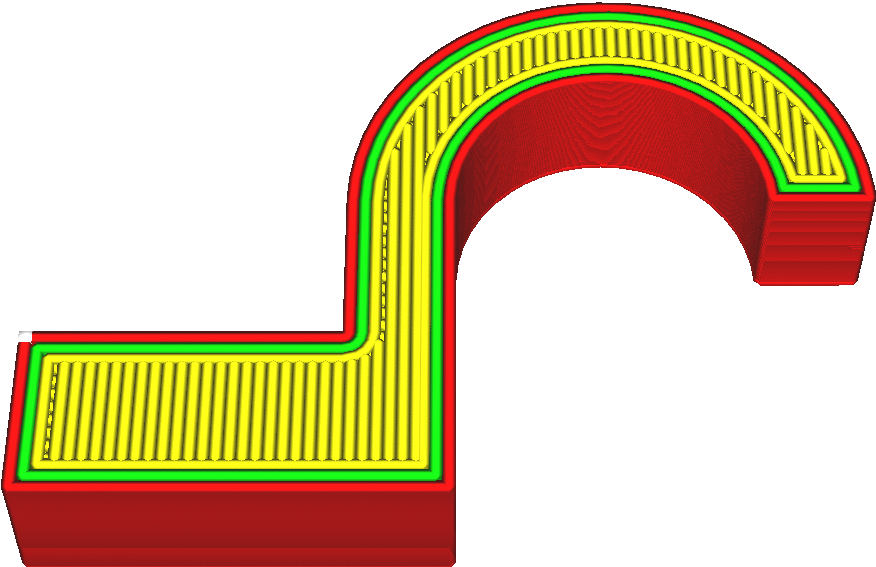

Směr linií horní/dolní strany
====
Toto nastavení umožňuje změnit směr tisku horních a spodních linií. Můžete zadat seznam úhlů oddělených čárkami (ve stupních) a linie budou střídat směry podle vrstvy.

Ve výchozím nastavení se vzor linií vytiskne dvěma diagonálními směry. U kartézských portálových systémů je to nejpřesnější, protože tiskárna může použít motory X a Y ke zrychlení trysky při převrácení o další řádek.

Existuje několik důvodů, proč změnit tyto směry:
* Pro získání optického efektu.
* Pro optimalizaci sílu. Tisk bude normálně odolnější, když je vystaven tlaku a tahu rovnoběžnému s liniemi pláště (a výplně).
* Chcete-li snížit převis. Pokud je tisk v jednom směru velmi jemný, může být vytvoření přemostění pláště v tomto směru účinným způsobem, jak ušetřit materiál na výplň. K vyplnění mezery nebude nutná žádná výplň. Stejně tak můžete také zvolit směr kolmý na výplň, abyste minimalizovali přetečení výplně. To poskytuje lepší kvalitu horního povrchu.
* Chcete-li optimalizovat přesnost, pokud vaše tiskárna nemá jeden motor pro směr X a jeden motor pro směr Y, jako je tiskárna s portálovým H-mostem nebo delta tiskárna.

Pro změnu směru každé vrstvy lze zadat několik čísel. Například zadáním `[0, 30, 60]` se střídá směr mezi 0, 30 a 60 stupni od osy X.
