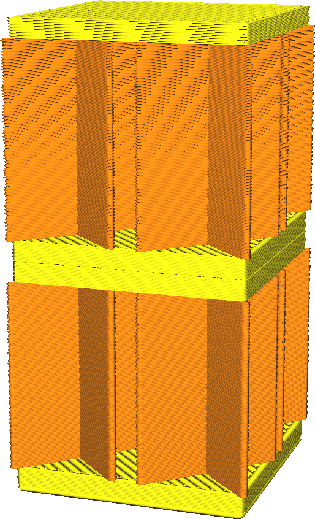

Žádný plášť v Z mezerách
====
Pokud má váš model malou vodorovnou štěrbinu menší, než je tloušťka horního/dolního pláště, toto nastavení se neobtěžuje úplně zaplnit horní a dolní část nad/pod ní kompletně pláštěm. Tím se šetří čas slicování a tisku, ale výplň může být vystavena plnění vzduchu.

Hlavním cílem této úpravy je zkrácení doby slicování. Toto nastavení účinně snižuje rozlišení, s nímž Cura odebírá vzorky povrchu z místa, kde mají být umístěny. V závislosti na tvaru modelu by to mohlo ušetřit 5 až 30% času slicování. Šetří také čas tisku v případě malých otvorů, protože místo pláště se tiskne výplň.

Pokud model nemá vodorovné mezery menší než je tloušťka pláště, bude jediným účinkem zkrácení doby slicování.

Pokud má model takové vodorovné mezery, bude výplň odhalena v prostoru. Pokud je však prostor dostatečně malý, bude převis prověšovat stěny tak, aby již nebyl vidět.
