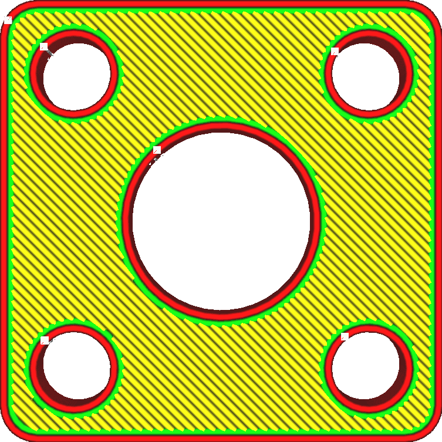

Procento překrytí pláště
====
Toto nastavení způsobí, že plášť mírně překrývá sousední struktury. Plášť tak k těmto strukturám lépe přilne.

Překrytí v tomto nastavení je vyjádřeno jako procento průměrné šířky linií mezi liniemi pláště a liniemi vnitřní stěny.

Toto překrytí technicky způsobuje nadměrné vytlačování, ale množství nadměrného vytlačování je dostatečně malé, aby nebylo vidět. To však bude mít významný vliv na pevnost, protože plášť může lépe přilnout ke stěnám a výplni. Koneckonců, tyto struktury zvyšují sílu modelu, pouze pokud mají něco, na čem se mohou držet.

Malé překrytí může také pomoci snížit výskyt mezer v plášti.