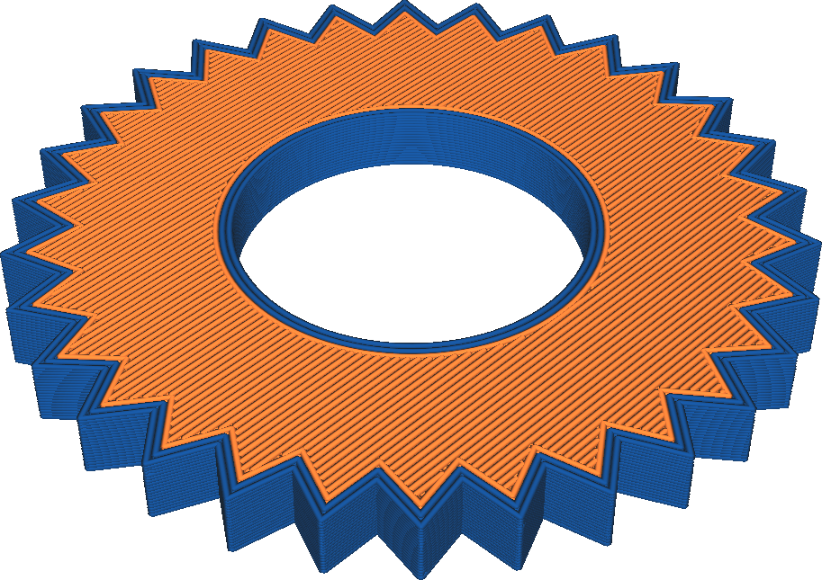

Extrudér pro horní/dolní stranu
====
Horní a spodní strana předmětu může být v případě potřeby vytištěna jiným extrudérem než zbytek modelu. Tento parametr umožňuje vybrat extrudér, který bude použit pro horní a dolní povrch.

Toto nastavení nemá žádný vliv na stěny, které jsou vytištěny vedle horní a dolní strany a budou viditelné z horní a dolní strany vašeho tisku.

Zde je několik příkladů použití, kdy jsou horní a dolní strany vytištěny jiným extrudérem:
* Tisk v jiné barvě pro vizuální efekt.
* Tisk měkčím materiálem, který dává modelu měkký pocit a zvyšuje tření, takže jej můžete snáze držet.
* Tisk tvrdým materiálem dává modelu větší horizontální pevnost při zachování dobré vizuální kvality vašeho dalšího materiálu na stěnách.
* Tisk materiálem s nízkým třením, aby ostatní objekty mohly snáze klouzat po povrchu, když se na vašem konečném návrhu podílejí pohyblivé části.