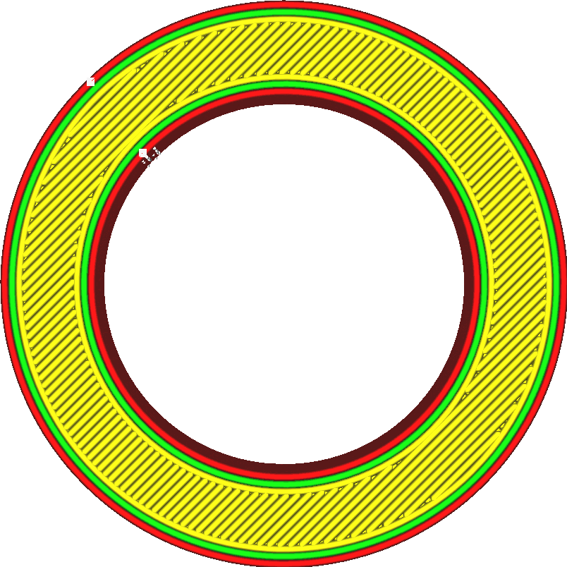

Vzor horní/dolní strany
====
Toto nastavení umožňuje zvolit, jak se horní a dolní povrch vyplní materiálem. K dispozici je několik různých vzorů tisku, ale vzory jsou zde omezenější než pro výplně. K dispozici jsou pouze vzory, které vytvářejí pevné vrstvy.

Lineární
---

Základní schéma kreslí na povrchu rovné linie. Tyto linie jsou ve výchozím nastavení orientovány tak, aby byly dobře podporovány výplní a podpěrou. Směr linií se mezi vrstvami střídá.
* Poskytuje dobrou kvalitu povrchu.
* Velmi tuhý ve směrech, kde jsou linie nakresleny.
* Silně ulpívá na stěnách a vytváří relativně pevné části.

Soustředný
----

Soustředný vzor pokračuje v kreslení obrysů modelu směrem dovnitř.
* Stejně tuhý ve všech směrech.
* Zabraňuje vytváření vzduchových kapes a mezer. U tohoto vzoru je snazší vytvářet vodotěsné předměty.
* Vysoká kvalita převisu, protože linie se velmi dobře překrývají.
* Je-li součást kruhová, může vytvořit nepříjemný bod ve středu, kde se kontury sbíhají.
* Kvalita povrchu zdaleka není ideální.

Cikcak
---

Cikcak vzor je velmi podobný lineárnímu vzoru, ale místo toho, aby ukončil linie ve stěnách, bude pokračovat ve vytlačování na další linii pláště.
* Poskytuje vysokou kvalitu povrchu.
* Velmi tuhý ve směrech, kde jsou linie nakresleny.
* Udržuje rychlost vytlačování konstantní, což zlepšuje konzistenci povrchu pro materiály, které je těžší vytlačovat.
* Nelepí se stejně dobře na stěny jako lineární vzor. Účinek parametru [Procento překrytí pláště](skin_overlap.md) je snížen. Tím je součást slabší a snižuje se kvalita převisů.

