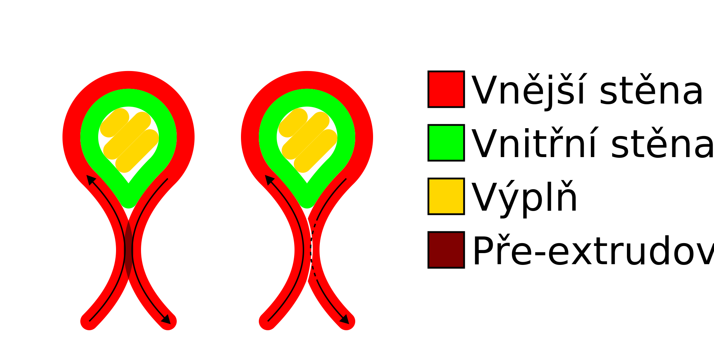
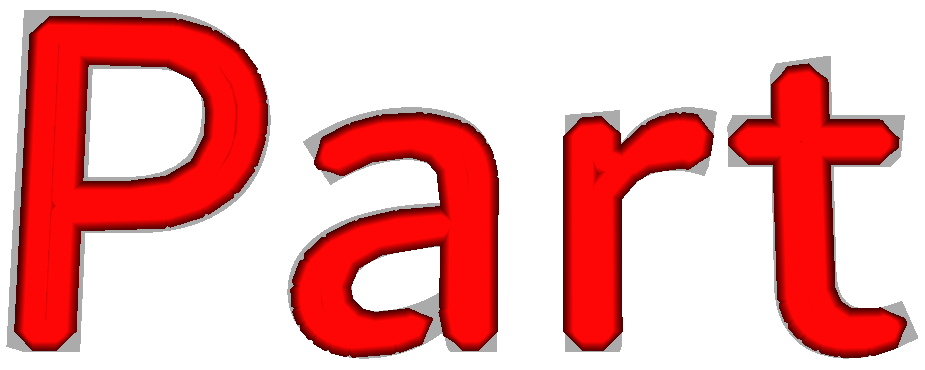
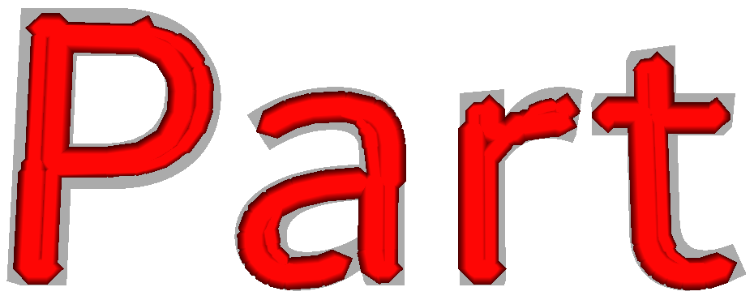

Kompenzovat překrytí vnější stěny
====
Při tisku velmi tenkých částí se protilehlé vnější stěny mohou dostat dostatečně blízko, aby se překrývaly. Vytisknutím obou stěn jejich normální šířkou linie by byly pře-extrudovány. Toto nastavení zabraňuje tomuto nadměrnému vytlačování zmenšením šířky jedné z linií, což zabrání tomuto pře-extrudování a dosahuje se lepší přesnosti rozměrů..

Šířka linie vnější stěny, která se překrývá s jinou vnější stěnou, je zmenšena oblastí překrytí. To kompenzuje nadměrné vytlačování.

Jak je popsáno výše, tato vlastnost má sklon ke zlepšení rozměrové přesnosti. Nevýhodou je však to, že tok se stává méně pravidelným, což vede k pod-extruzi na některých místech a nad-extruzi v jiných místech. Kromě toho se průtok může snížit pod minimální průtok tryskou a extrudérem, což má za následek nepravidelný průtok a zesílení. Pro snížení tohoto efektu můžete definovat [Minimální tok pro stěny](wall_min_flow.md), který přemění některé z nejtenčích stěn na pohyby přesunu na úkor rozměrové přesnosti.

**Toto nastavení má sklon a vypadat v zobrazení vrstev chaoticky. Ve skutečném tisku neexistují žádné hranice mezi liniemi. Pohled na vrstvu ukazuje pouze cesty g-kódu, ale ve skutečnosti je tento materiál odsunut stranou druhou stěnou, se kterou se překrývá. Kromě toho se na skutečném tisku nezobrazí malá omezení průtoku, protože průtok přes trysku se nemůže upravit tak rychle. Díky těmto efektům je skutečný tisk hladší, než předpovídá zobrazení vrstev.**.

