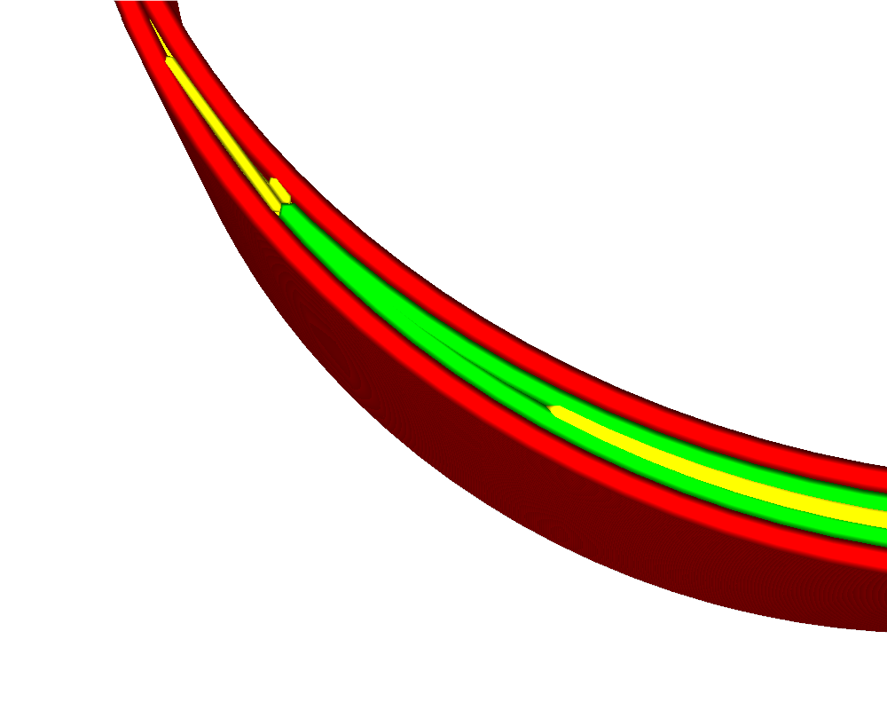
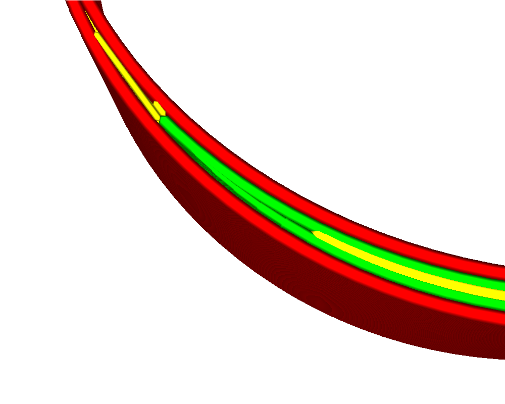

Kompenzace překrytí vnitřních stěn
====
Při tisku jemných částí se mohou protilehlé stěny přiblížit natolik, aby se překrývaly. Vytisknutím obou stěn jejich normální šířkou linie by byly pře-extrudovány. Toto nastavení zabraňuje tomuto nadměrnému vytlačování zmenšením šířky jedné z linií, což tomuto pře-extrudování zabrání a dosahuje se lepší přesnosti rozměrů.

Toto nastavení platí pouze pro vnitřní stěny. Kompenzace překrývání vnitřních stěn je na vnější straně méně viditelná, protože bude viditelných méně artefaktů změny toku, ale přesto přispěje k omezení účinku vytlačování, protože vnitřní stěny budou méně tlačeny k vnějším.

Šířka linie stěny, která se překrývá s jinou stěnou, se zmenšuje o oblast překrytí. To kompenzuje nadměrné vytlačování.

Jak je popsáno výše, tato vlastnost má sklon ke zlepšení rozměrové přesnosti. Nevýhodou je však to, že tok se stává méně pravidelným, což vede k pod-extrudování na některých místech a nad-extrudování v jiných místech. Kromě toho lze průtok snížit pod minimální průtok tryskou a extrudérem, což má za následek nepravidelný průtok a zesílení. Pro snížení tohoto efektu můžete definovat [Minimální tok pro stěny](wall_min_flow.md), který transformuje některé z nejtenčích stěn na pohyby přesunu na úkor rozměrové přesnosti.

**Toto nastavení má sklon vypadat v zobrazení vrstev chaoticky. Ve skutečném tisku neexistují žádné hranice mezi liniemi. Pohled na vrstvu ukazuje pouze cesty g-kódu, ale ve skutečnosti je tento materiál odsunut stranou druhou stěnou, se kterou se překrývá. Kromě toho se na skutečném tisku nezobrazí malá omezení průtoku, protože průtok přes trysku se nemůže upravit tak rychle. Díky těmto efektům je skutečný tisk hladší, než předpovídá zobrazení vrstev.**
