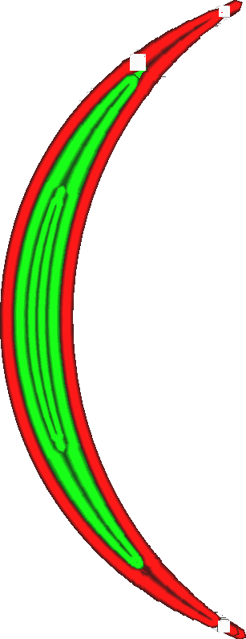

Práh rozdělení střední linie
====
Při tisku tenkých dílů přizpůsobí Cura šířku linií stěn tak, aby přesně odpovídala šířce modelu. Cura se také může rozhodnout, že místo toho použije menší počet linií stěn. Toto nastavení představuje hranici, při které Cura rozdělí jednu linii uprostřed na dvě, když se šířka dílu zvětší. Lze jej nastavit odděleně od nastavení [prahu, při kterém se přidá nová středová linie](wall_add_middle_threshold.md).

Toto nastavení je stejné jako nastavení [Minimální šířka sudé stěny](min_even_wall_line_width.md), ale používá jinou jednotku. Jednotka tohoto nastavení je ve zlomcích šířky linie, o kterou se musí zvětšit šířka dílu, aby se středová linie rozdělila na dvě části. Protože se rozdíl šířek po rozdělení rozdělí na dvě linie uprostřed, odpovídá menší hodnota Minimální šířky linie sudé stěny mnohem menší prahové hodnotě rozdělení střední linie než v případě odstranění liché stěny.

Sudé vs. liché linie
----
Toto nastavení umožňuje upravit práh pro přidávání linií, a to konkrétně v případě, že se jedná o sudý počet linií. To je případ, kdy jsou uprostřed dvě linie místo jedné. Určuje, kdy se linie uprostřed rozdělí na dvě linie.

Práh pro rozdělení středové linie se může lišit od prahu pro přidání středové linie kvůli způsobu jejich spojení. Sudé linie se na svých koncích spojují tak, že se jejich konce k sobě přibližují. Tam dochází k určitému překrývání těchto linií, což vede k jejich přetlačování. To se liší od situace, kdy je stěn lichý počet: Linie uprostřed se pak prostě zastaví a v tisku zůstane mezera. Snížení prahové hodnoty rozdělení středové linie snižuje přesah na přechodech ze sudých do lichých linií. Snížení hodnoty prahu přidání středové linie snižuje velikost mezery na přechodech z lichých do sudých linií.

TMezery ponechané při přidávání středové linie jsou v konečném výsledku viditelnější než trocha převýšení ve spoji, takže by mohlo pomoci nastavit prahovou hodnotu rozdělení středové linie o něco výše než prahovou hodnotu přidání středové linie.

Snížení tohoto nastavení vede k:
* Zmenšení oblasti překrytí v místech, kde se dvě linie spojují do jedné linie.
* Zmenšení maximální šířky jednotlivých středových linií.
* Tenčí linie, které se nemusí dobře vytlačovat.
* Více linií, jejichž tisk trvá déle.

**Toto nastavení se nevztahuje pouze na běžné stěny, ale také na dodatečné stěny, podpůrné stěny, výplňové stěny a soustředné vzory.**