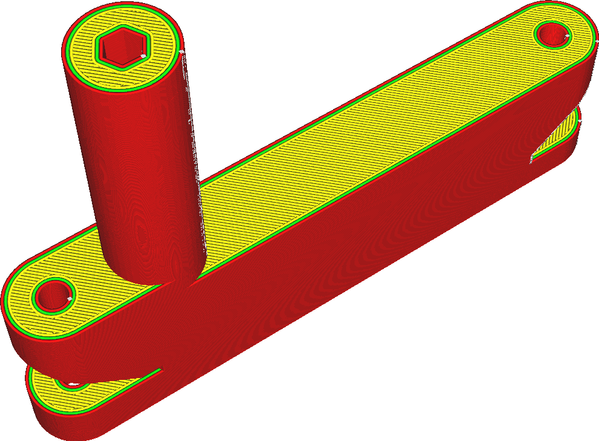

Horizontální rozšíření
====
Díky tomuto nastavení je celý model o něco širší nebo tenčí. Je to opatření k vyrovnání rozměrových nepřesností v procesu tisku.

Kladná hodnota rozšíří tisk. Tím se zmenší velikost dutin. Záporná hodnota učiní tisk štíhlejším a zvětší velikost dutin.

Pokud je tolerance tisku důležitá, může být tento parametr velmi užitečný. Vzhledem k malé deformaci plastů nemusí skutečné rozměry tisku zcela odpovídat rozměrům digitálního modelu. Chyby zesílení lze kompenzovat pouhým přizpůsobením modelu na tiskové podložce pomocí nástroje pro změnu měřítka, ale pomocí tohoto nastavení lze kompenzovat chyby offsetu způsobené metodou tisku.

Pokud víte, že vaše tiskárna stále tiskne příliš široko kvůli přílišnému vytlačování nebo nepřesnosti v jejím pohybu, můžete toto nastavení také kompenzovat.
