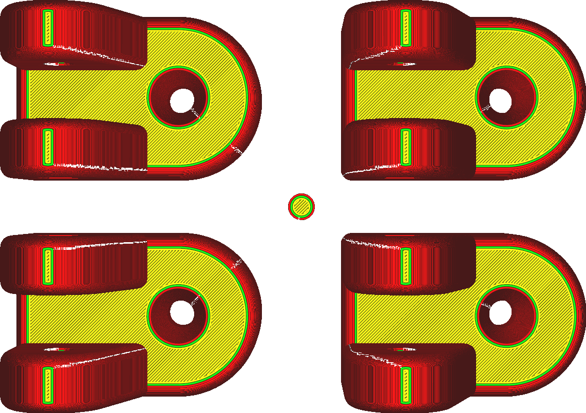
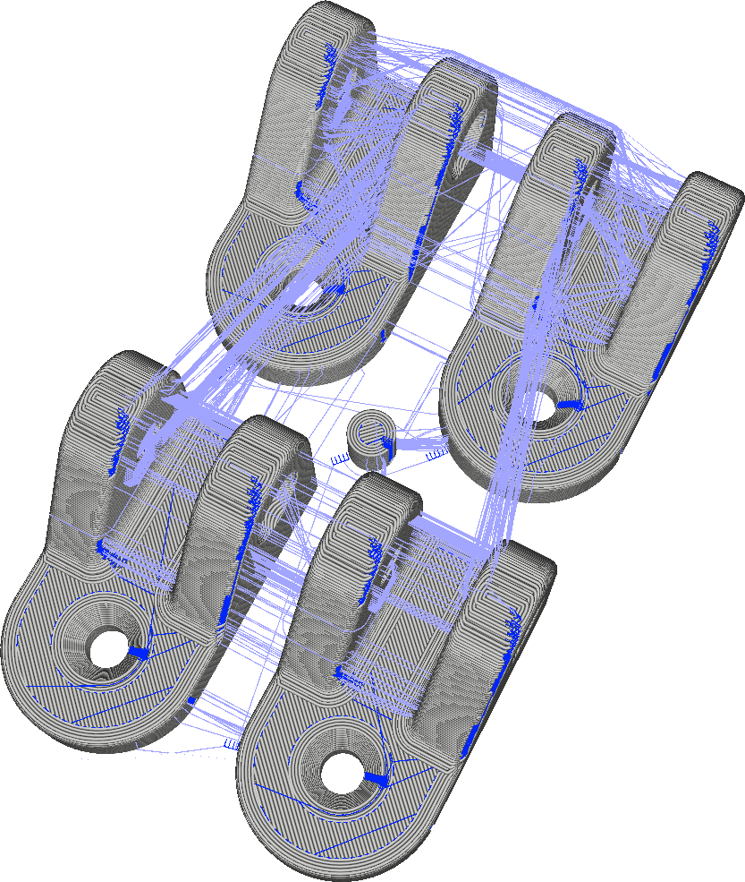

Relativní šev v Z
====
Když je šev umístěn na místě určeném uživatelem podle nastavení parametru [Zarovnání švu v Z](z_seam_type.md), můžete zadat souřadnice pozice, kde má být šev umístěn. Tyto souřadnice obvykle označují umístění na tiskové podložce, například na zadní straně tiskárny. Pokud je tento parametr aktivován, budou tyto souřadnice vzaty relativně vzhledem k poloze modelu.

Je-li na tiskové podložce duplikován model, toto nastavení způsobí, že šev bude umístěn na přesně stejném místě pro každý duplikát, než aby je směřoval na stejný bod na tiskové podložce. To vám umožní vytisknout každou kopii přesně stejným způsobem, bez ohledu na její polohu na tiskové podložce.