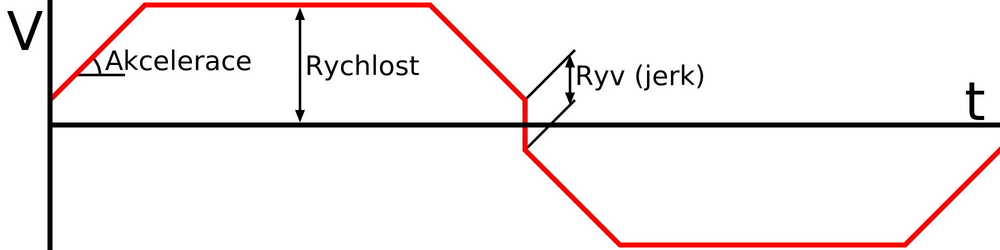

Zrychlení tisku
====
Hodnota, se kterou může tisková hlava zrychlovat na požadovanou rychlost při spuštění, zastavení nebo změně směru. Stejně jako auto musí tisková hlava akcelerovat, aby změnila rychlost nebo směr.

Zvyšující se zrychlení umožňuje tiskové hlavě dosáhnout požadované rychlosti a směru rychleji. Tisk bude proto rychlejší, zejména u malých dílů, ale také způsobí více vibrací. Tyto vibrace snižují rozměrovou přesnost a způsobují zvlnění.
