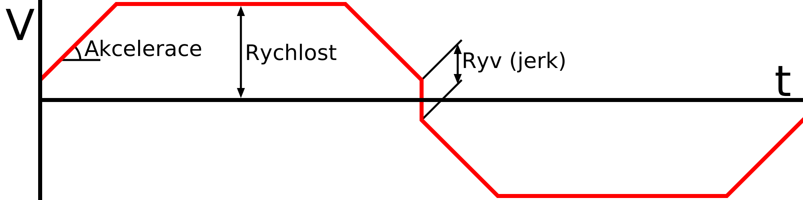

Aktivovat řízení ryvu (jerku)
====
Jerk určuje rychlost, jakou může tryska procházet rohy. Pokud je aktivováno řízení ryvu (jerku), Cura převezme kontrolu nad množstvím ryvu (jerku), které má být aplikováno během různých částí tisku. Pokud je zakázáno, vybere hodnotu ryvu (jerku) firmware tiskárny. Tato hodnota je obvykle dostatečně vysoká, aby poskytla sliceru větší kontrolu, ale tiskárna může mít více informací o svém vlastním hardwaru, než má Cura.

**Ryv (jerk) ve 3D tisku není totéž jako ryv (jerk) ve fyzice.** Termín "ryv (jerk)" byl představen Marlinem. Byl zamýšlen jako řešení problému spojeného se snahou dokonale sledovat cestu. Protože se tryska nemůže teoreticky odchýlit od trajektorie, měla by se v každém rohu zpomalit na 0 mm/s. To by zničilo váš tisk, protože zpomalení na 0 mm/s by způsobilo v každém rohu skvrnu. Není dovoleno vytvářet křivky pro zkrácení rohu, ani pro jeho překročení. Místo toho Marlin umožňuje okamžitou změnu vektoru rychlosti v každém rohu. Velikost této změny ve vektoru rychlosti se nazývá "ryv (jerk)".

Ryv (jerk) je tedy maximální okamžitá změna rychlosti, aplikovaná na pohyb v každém rohu.

Firmware, který není založen na Marlinovi, stejně jako firmware rodiny Sailfish, ignoruje změny ryvu (jerku). Toto nastavení nebude mít žádný efekt.

Příklad matematiky ryvu (jerku)
----
Vezměme například velmi jednoduchý tisk: Nejprve posun o 100 mm doprava, poté o 100 mm dolů. Rychlost tisku je stanovena na 50 mm/s. Zrychlení je nastaveno na 1 000 mm/s^2. Ryv (jerk) je nastaven na 10 mm/s. Co se stane:
1. Na začátku tisku, Marlin vezme polovinu hodnoty ryvu (jerku), tak aby teoreticky okamžitě zrychlil na 5 mm/s.
2. Při zrychlení 1 000 mm/s^2 bude trvat 0,045 s, aby došlo k přechodu z 5 mm/s na maximální rychlost 50 mm/s. Mezitím tryska pokryje 1,2375 mm.
3. Tryska se krátce pohybuje rychlostí 50 mm/s, což maximální rychlost tisku.
4. Marlin spočítá, jak rychle může tryska projít rohem: Tryska se otočí o 90 stupňů, nejprve doprava, poté dolů. Chcete-li omezit tuto změnu rychlosti, vstoupí do rohu při cos(90/2) * (10/2) mm/s doprava a z rohu vystoupí při cos(90/2) * (10/2) mm/s směrem dolů. Bude tedy procházet rohem rychlostí kolem 7,07 mm/s.
5. Bude trvat 0,043 s, než se zpomalí z 50 mm/s na 7,07 mm/s.
6. Roh je vytvořen s okamžitou změnou rychlosti. Velikost rozdílu mezi vektory [7,07; 0] a [0; 7,07] je přesně 10 mm/s, což umožňuje okamžité provedení tohoto rohu.
7. Zrychlení z 7,07 mm/s na 50 mm/s bude trvat 0,043 s.
8. Tryska se po určitou dobu pohybuje opět rychlostí 50 mm/s, což je maximální rychlost tisku.
9. Ke konci tisku tryska zpomalí z 50 mm/s na 0 mm/s za 0,05 s.