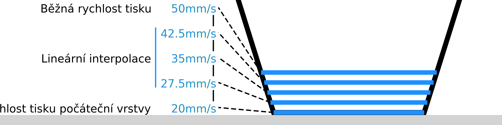

Počet pomalejších vrstev
====
Počáteční vrstva není jedinou vrstvou, která se tiskne pomaleji. Toto nastavení umožňuje nakonfigurovat počet vrstev, které se tisknou pomaleji. Během těchto vrstev se rychlost tisku postupně zvýší na normální rychlost tisku.

Počínaje počáteční vrstvou se rychlost lineárně zvyšuje (nebo snižuje) na běžnou rychlost tisku. To se děje samostatně u stěn, pláště, výplně atd., pokud jsou tištěny různými rychlostmi.

Existují dva důvody, proč byste mohli chtít přejít na normální rychlost tisku v několika vrstvách. Za prvé, druhá a třetí vrstva jsou stále docela blízko k podložce tisku a rychlé vznášení se nad nimi může docela snadno tisk natrhnout. Za druhé, rozdíl v toku mezi rychlostí tisku počáteční vrstvy a běžnou rychlostí tisku může být tak velký, že změna k velkému průtoku může chvíli trvat. Pomalý přechod zabraňuje pod-extruzi při velké změně rychlosti.

Pomalý přechod však také prodlužuje celkovou dobu tisku.
