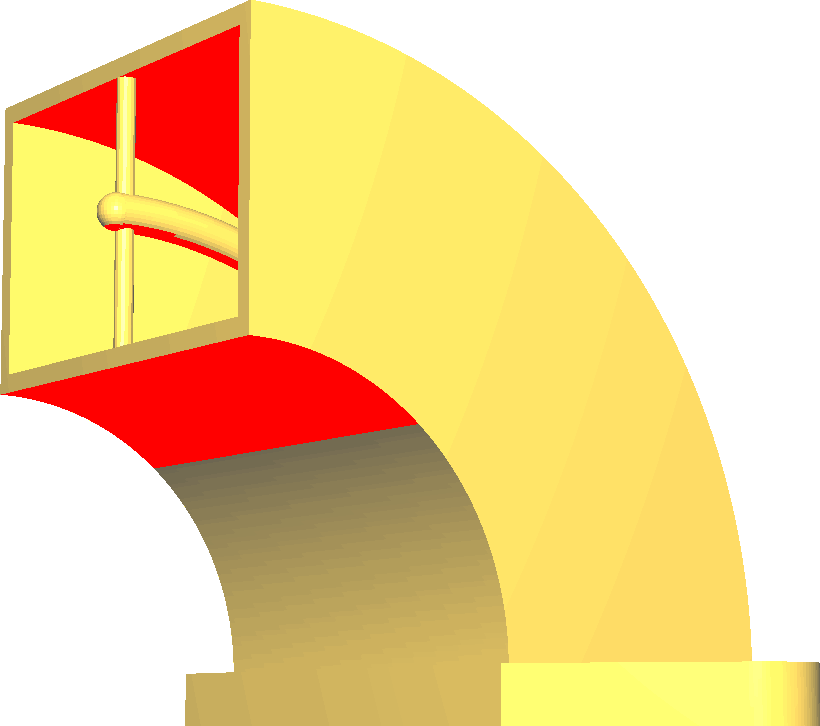

Úhel převisu pro podpěru
====
Úhel převisu ovlivňuje množství materiálu umístěného na podpěru tisku. Úhel označuje minimální podpíraný úhel.

**Snížení hodnoty tohoto parametru generuje větší podpěru.**

Snížením tohoto nastavení tiskárna podpírá více tištěné oblasti, dokonce i oblasti, které jsou rovnější a během tisku se příliš neoslabují. Pokud podpěra podpírá části, které nemusí být podpírány, zbytečně to prodlouží dobu tisku a použití materiálu a také vytvoří značky, pokud se podpěra dotkne tisku.

Někdy je však nutné snížit úhel podpěry, aby se zabránilo příliš velkému prohýbání materiálu. To obecně zlepšuje rozměrovou přesnost finální části a také zlepšuje vzhled přesahů.

Při práci s podpěrou je dobré zobrazit náhled podpěry během fáze náhledu. Pak budete mít možnost vidět, kde se bude skutečně generovat podpěra. Úprava tohoto parametru je pak jedním z nástrojů, které máte k dispozici k filtrování přesného místa, kde se bude podpěra generovat.
