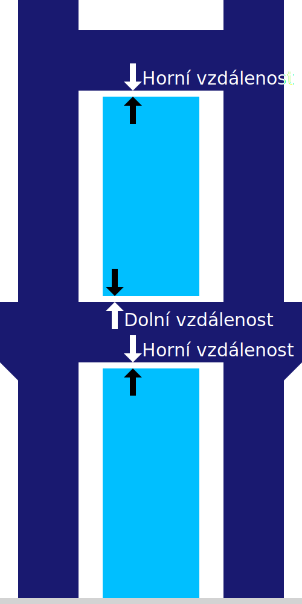

Vzdálenost podpěry dole
====
Tento parametr umožňuje upravit vzdálenost mezi spodní stranou podpěry a modelem, kde podpěra spočívá na modelu.

Pokud je podpěra jednoduše vytištěna na horní straně modelu, bude k němu velmi pevně přilepena. Nejlepší je dodržovat určitou vzdálenost. Tímto způsobem je snazší podpěru odlomit a zanechá méně jizev vašem tisku. Pokud však vzdálenost příliš zvětšíte, bude podpěra nestabilní.

Pokud je vaše podpora rozpustná, může být tato vzdálenost velmi malá. Není tedy problém ji rozbít a nezanechává jizvu.