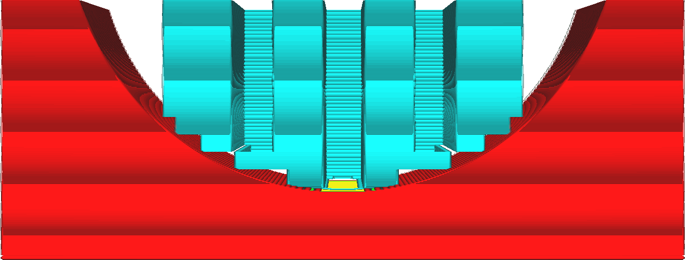

Minimální úhel sklonu schodu podpěry
====
Tímto nastavením můžete zakázat stupňování schodů na nejnižší části podpěry, a to až do určitého úhlu sklonu modelu.

Na mírných svazích mohou být kroky schodů dole velmi široké. Nikdy nemohou být širší než to, co udává [maximální šířka schodu podpěry](support_bottom_stair_step_width.md), ale protože tato vzdálenost je dodržena ze všech stran, mohou být stupně schodů tak široké, že zde bude značná vzdálenost, kterou bude muset podpěra přemostit. Pokud existuje malé údolí, ve kterém podpěra spočívá, může to dokonce způsobit, že přeskočí celou spodní stranu, takže celá podpěra spočívá pouze na rozích stupňů schodů.

V takovém případě můžete omezit schodiště pouze na strmých svazích. Toto nastavení určuje, co v tomto ohledu představuje "strmý" svah.

Zvýšení tohoto nastavení zabrání programu Cura generovat schodišťové stupně na mělkých površích. Díky tomu bude podpěra robustnější, ale bude obtížnější ji odstranit. Vaše podpěra zanechá na povrchu více jizev. Snížení usnadňuje odstranění podpěry a zanechá hezčí povrch, na kterém podpěra spočívala, ale v některých případech může způsobit, že podpěra bude muset přemostit dlouhé vzdálenosti nebo dokonce může vypadat, že zcela visí ve vzduchu.

Chcete-li získat pěkný povrch, je nejlepší nechat toto nastavení v konzervativním nízkém úhlu, asi 5° nebo 10°. Pokud se podpěra opírá o povrch, který je mělký, ale ne zcela plochý, zkontrolujte náhled vrstev a zvětšete úhel, pokud zjistíte, že podpěra vypadá velmi nejistě.