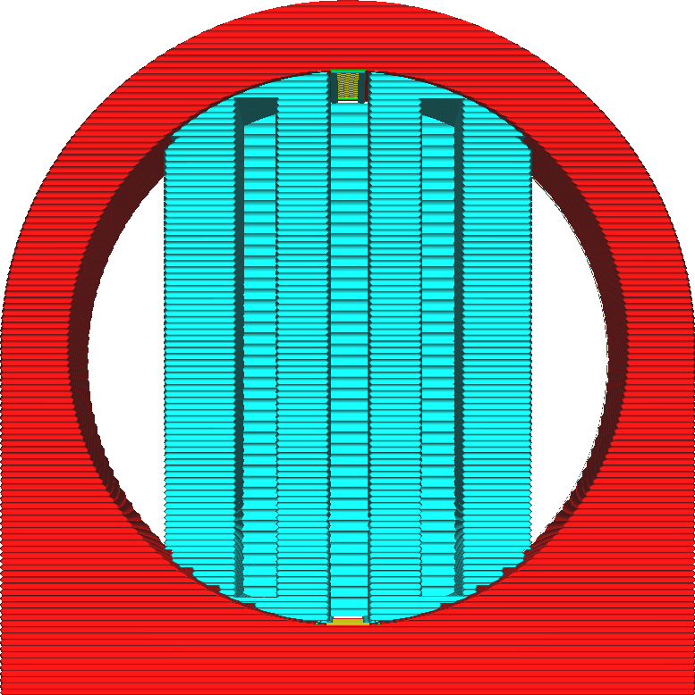

Maximální šířka kroku schodu podpěry
====
Pokud je položka [Umístění podpěry](support_type.md) nastavena na "Kdekoliv", může podpěra spočívat na modelu. Nebude však přesně sledovat obrysy modelu. Místo toho má podlaha podpěry stupňovitý vzor. Tímto způsobem podpěra naváže spojení s modelem pouze na několika místech.

Toto nastavení určuje maximální šířku těchto kroků. Krok má obvykle šířku, která sleduje povrch modelu hodnotou danou parametrem [Výška kroku schodů podpěry](support_bottom_stair_step_height.md). Pokud je však příliš široká, je šířka omezena na maximální šířku kroku schodu podpěry. Poté po zbytek kroků sleduje povrch modelu.

Tento parametr by mělo být normálně nastaven na maximální vzdálenost, kterou může materiál překlenout, aniž by byla ohrožena stabilita podpůrných linií nad ním. Snížením nastavení podpěra častěji sleduje model, díky němuž je stabilnější. Zvýšení nastavení znamená, že podpěra častěji respektuje hodnotu nastavenou pro výšku schodu podpěry, což usnadňuje vyjmutí podpěry z modelu.