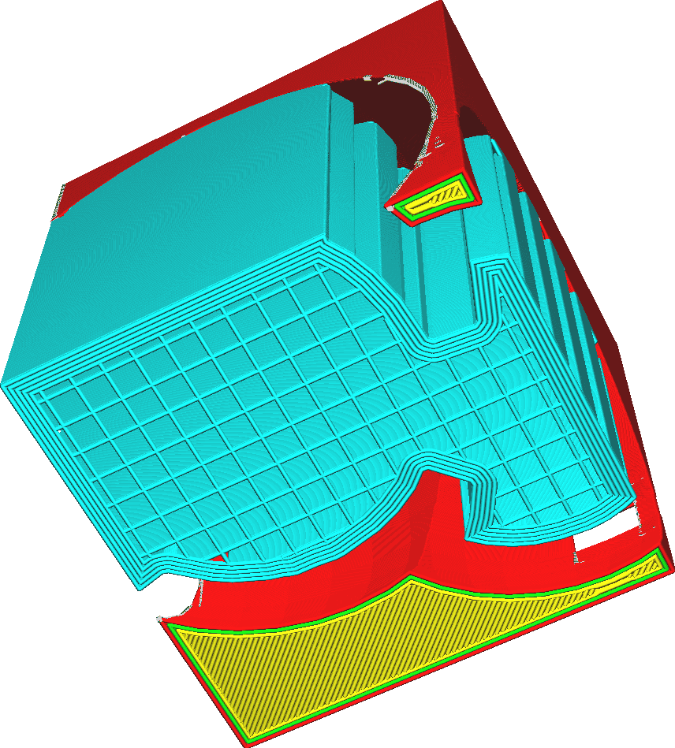

Počet linií krempy podpěry
====
Tento parametr upravuje počet kontur, které budou vykresleny uvnitř podpůrné oblasti pro krempu podpěry. Čím větší počet linií, tím větší je krempa.

Větší počet linií krempy zvýší přilnavost podpěry k podložce tisku a sníží deformaci podpěry. Výsledkem bude, že podpěra bude silnější, což zlepší spolehlivost tisku.
