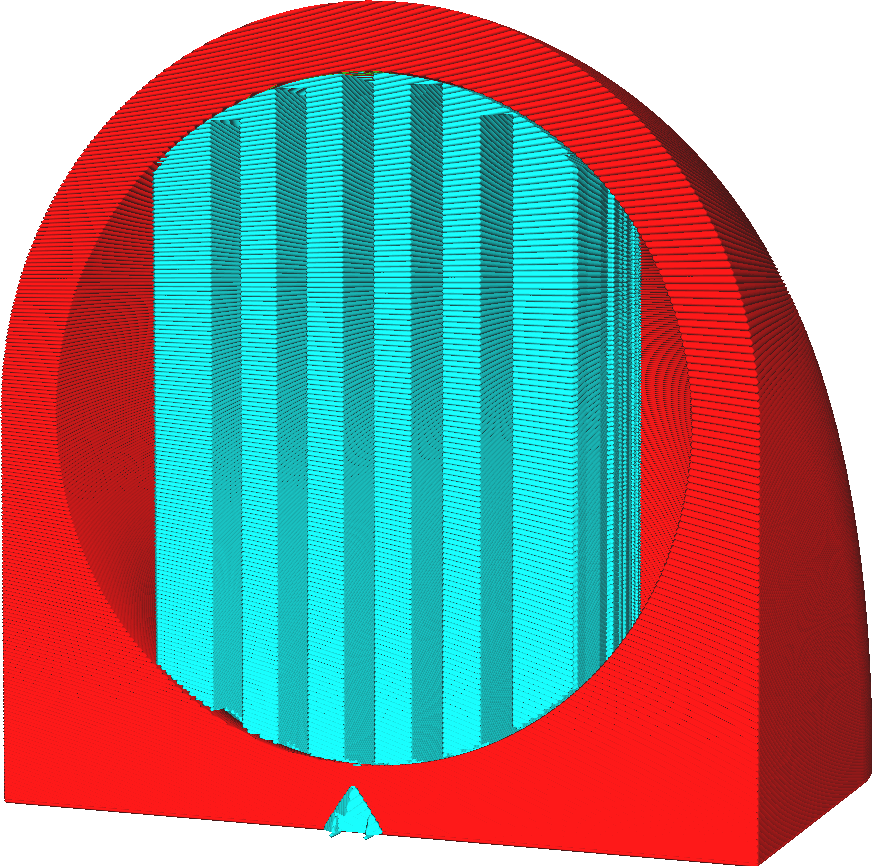

Generovat podpěru
====
3D tiskárny s výrobou roztaveného vlákna pracují tak, že na správná místa umístí řetězec roztaveného plastu. Pokud tento plast nebude podepřen, bude klesat, protože se vytlačí z trysky velkou silou a kvůli gravitaci. Pokud není pod ním model, aby podporoval novou vrstvu, bude muset být podpírán další podpůrnou strukturou, která bude po tisku modelu odstraněna a zahozena.

Toto nastavení vytváří podpůrné struktury pro podporu objektu během tisku. Cura ve výchozím nastavení tuto podpěru neaktivuje, ale pokud si myslí, že materiál v ní obsažený by se mohl hodně prohýbat, pokud nebude podpěra aktivována, označí povrch modelu červeně.

Tisk podpěry vyžaduje spoustu času a materiálu. Kde se podpěra dotkne modelu, měla by se později po dokončení tisku rozbít nebo oříznout. To má sklon zanechávat na povrchu jizvu.

Podpěra je však někdy zcela nezbytná. Například, pokud má model kus směřující dolů k tiskové podložce, jinak by tento kus jednoduše visel ve vzduchu.

Návrh pro zabránění podpěře
----

Ačkoli je to někdy nutné, je třeba se co nejvíce vyhnout tiskovým podpěrám. Existuje mnoho technik, jak se vyhnout nutnosti tisknout podpěru. Toto je velká část návrhů modelů pro 3D tisk. Zde je několik technik úpravy vašeho 3D modelu, abyste se vyhnuli potřebě podpěry.
* Orientujte svůj model tak, aby neexistovaly žádné rovné povrchy výše než tisková podložka.
* Vyvarujte se co nejvíce přesahům.
* Pokud je povrch těsně nad tiskovou podložkou, přitáhněte ho dolů na tiskovou podložku.
* Malé římsy mohou být podepřeny sklonem 45 stupňů, což umožňuje přenést převis do modelu.
* Větší přesahy mohou být přemostěny, pokud jsou podpírány na obou stranách. Cura bude automaticky orientovat linie na spodní straně tohoto převisu tak, aby procházely v přímé linii přes most. Během tisku těchto linií bude tryska udržovat napětí na vláknu tak, aby nesklouzlo dolů. To mu pak dá dostatek času na ztuhnutí, aby se mohlo samo udržet.
* Pokud je v převisu mezera, lze navrhnout obětní můstek. Je to vrstva, kterou je mezera uzavřena. To umožňuje vybudovat dobrý most, takže druhá vrstva může nahoře postavit odpovídající prostorové stěny. Po tisku lze štěrbinu otevřít nožem, protože je silná pouze jednu vrstvu.